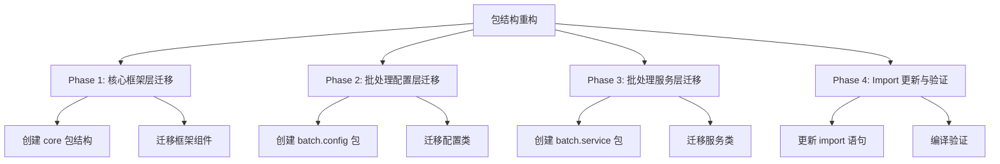
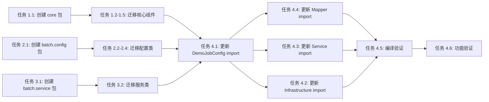

# 功能规划：BatchWeaver 包结构重构

**规划时间**：2026-01-19
**预估工作量**：18 任务点

---

## 1. 功能概述

### 1.1 目标
将 BatchWeaver 项目的包结构按照分层架构重构，实现核心框架层与批处理业务层的清晰分离，提升代码可维护性和可扩展性。

### 1.2 范围
**包含**：
- 将框架核心组件移动到 `com.batchweaver.core` 包
- 将批处理配置移动到 `com.batchweaver.batch.config` 包
- 将批处理服务移动到 `com.batchweaver.batch.service` 包
- 更新所有受影响的 import 语句
- 验证重构后的编译和运行

**不包含**：
- 业务逻辑的修改
- 数据库结构的变更
- 配置文件的调整（除包名引用外）

### 1.3 技术约束
- Java 21 + Spring Boot 3.5.7 + Spring Batch 5.x
- 必须保持事务隔离机制不变（tm1 与 tm2/tm3/tm4 隔离）
- 重构过程中不能破坏现有功能
- 所有类的功能保持不变，仅调整包结构

---

## 2. WBS 任务分解

### 2.1 分解结构图



### 2.2 任务清单

#### Phase 1：核心框架层迁移（5 任务点）

**目标包**: `com.batchweaver.core`

- [ ] **任务 1.1**：创建核心框架包结构（1 点）
  - **输入**：当前项目结构
  - **输出**：新的包目录结构
  - **关键步骤**：
    1. 创建 `com.batchweaver.core.reader` 包
    2. 创建 `com.batchweaver.core.processor` 包
    3. 创建 `com.batchweaver.core.writer` 包
    4. 创建 `com.batchweaver.core.validator` 包
    5. 创建 `com.batchweaver.core.util` 包

- [ ] **任务 1.2**：迁移 Reader 组件（1 点）
  - **输入**：`com.batchweaver.batch.reader.AnnotationDrivenFieldSetMapper`
  - **输出**：`com.batchweaver.core.reader.AnnotationDrivenFieldSetMapper`
  - **关键步骤**：
    1. 移动 `AnnotationDrivenFieldSetMapper.java` 到 `core.reader` 包
    2. 更新类的 package 声明为 `com.batchweaver.core.reader`
    3. 保持类内部逻辑不变

- [ ] **任务 1.3**：迁移 Processor 组件（1 点）
  - **输入**：`com.batchweaver.batch.processor.DataCleansingProcessor`
  - **输出**：`com.batchweaver.core.processor.DataCleansingProcessor`
  - **关键步骤**：
    1. 移动 `DataCleansingProcessor.java` 到 `core.processor` 包
    2. 更新 package 声明

- [ ] **任务 1.4**：迁移 Validator 组件（1 点）
  - **输入**：`com.batchweaver.batch.validator.*`
  - **输出**：`com.batchweaver.core.validator.*`
  - **关键步骤**：
    1. 移动 `HeaderValidator.java`（如存在）到 `core.validator` 包
    2. 移动 `FooterValidator.java`（如存在）到 `core.validator` 包
    3. 更新 package 声明

- [ ] **任务 1.5**：迁移工具类（1 点）
  - **输入**：`com.batchweaver.util.*`
  - **输出**：`com.batchweaver.core.util.*`
  - **关键步骤**：
    1. 移动 `CsvInjectionSanitizer.java`（如存在）到 `core.util` 包
    2. 移动 `FilePathNormalizer.java`（如存在）到 `core.util` 包
    3. 更新 package 声明

#### Phase 2：批处理配置层迁移（4 任务点）

**目标包**: `com.batchweaver.batch.config`

- [ ] **任务 2.1**：创建批处理配置包结构（1 点）
  - **输入**：当前 `com.batchweaver.config` 包
  - **输出**：新的 `com.batchweaver.batch.config` 包
  - **关键步骤**：
    1. 创建 `com.batchweaver.batch.config` 包
    2. 创建 `com.batchweaver.batch.config.datasource` 子包
    3. 创建 `com.batchweaver.batch.config.infrastructure` 子包

- [ ] **任务 2.2**：迁移数据源配置类（1 点）
  - **输入**：`com.batchweaver.config.datasource.*`
  - **输出**：`com.batchweaver.batch.config.datasource.*`
  - **关键步骤**：
    1. 移动 `DataSource1Config.java` 到 `batch.config.datasource` 包
    2. 移动 `DataSource2Config.java` 到 `batch.config.datasource` 包
    3. 移动 `DataSource3Config.java` 到 `batch.config.datasource` 包
    4. 移动 `DataSource4Config.java` 到 `batch.config.datasource` 包
    5. 更新所有类的 package 声明

- [ ] **任务 2.3**：迁移 Batch 基础设施配置（1 点）
  - **输入**：`com.batchweaver.config.batch.BatchInfrastructureConfig`
  - **输出**：`com.batchweaver.batch.config.infrastructure.BatchInfrastructureConfig`
  - **关键步骤**：
    1. 移动 `BatchInfrastructureConfig.java` 到 `batch.config.infrastructure` 包
    2. 更新 package 声明
    3. 保持 `@EnableBatchProcessing` 注解配置不变

- [ ] **任务 2.4**：迁移 Job 配置类（1 点）
  - **输入**：`com.batchweaver.config.batch.DemoJobConfig`
  - **输出**：`com.batchweaver.batch.config.DemoJobConfig`
  - **关键步骤**：
    1. 移动 `DemoJobConfig.java` 到 `batch.config` 包
    2. 更新 package 声明
    3. 保持 Job/Step 配置逻辑不变

#### Phase 3：批处理服务层迁移（3 任务点）

**目标包**: `com.batchweaver.batch.service`

- [ ] **任务 3.1**：创建批处理服务包结构（0.5 点）
  - **输入**：当前 `com.batchweaver.service` 包
  - **输出**：新的 `com.batchweaver.batch.service` 包
  - **关键步骤**：
    1. 创建 `com.batchweaver.batch.service` 包

- [ ] **任务 3.2**：迁移业务服务类（2.5 点）
  - **输入**：`com.batchweaver.service.*`
  - **输出**：`com.batchweaver.batch.service.*`
  - **关键步骤**：
    1. 移动 `Db1BusinessService.java`（如存在）到 `batch.service` 包
    2. 移动 `Db2BusinessService.java` 到 `batch.service` 包
    3. 移动 `Db3BusinessService.java`（如存在）到 `batch.service` 包
    4. 移动 `Db4BusinessService.java`（如存在）到 `batch.service` 包
    5. 更新所有类的 package 声明
    6. 保持 `@Transactional` 注解的 transactionManager 配置不变

#### Phase 4：Import 更新与验证（6 任务点）

- [ ] **任务 4.1**：更新 DemoJobConfig 的 import（1 点）
  - **输入**：`com.batchweaver.batch.config.DemoJobConfig`
  - **输出**：更新后的 import 语句
  - **关键步骤**：
    1. 更新 `AnnotationDrivenFieldSetMapper` 的 import 为 `com.batchweaver.core.reader.AnnotationDrivenFieldSetMapper`
    2. 更新 `DataCleansingProcessor` 的 import 为 `com.batchweaver.core.processor.DataCleansingProcessor`
    3. 更新 `Db2BusinessService` 的 import 为 `com.batchweaver.batch.service.Db2BusinessService`
    4. 保持 domain 包的 import 不变

- [ ] **任务 4.2**：更新 BatchInfrastructureConfig 的 import（0.5 点）
  - **输入**：`com.batchweaver.batch.config.infrastructure.BatchInfrastructureConfig`
  - **输出**：更新后的 import 语句
  - **关键步骤**：
    1. 检查是否有对其他配置类的引用
    2. 更新相关 import 语句

- [ ] **任务 4.3**：更新业务服务类的 import（1 点）
  - **输入**：`com.batchweaver.batch.service.*`
  - **输出**：更新后的 import 语句
  - **关键步骤**：
    1. 更新 domain.entity 的 import（保持不变）
    2. 验证 Spring 注解的 import 正确

- [ ] **任务 4.4**：更新 AnnotationDrivenFieldSetMapper 的 import（1 点）
  - **输入**：`com.batchweaver.core.reader.AnnotationDrivenFieldSetMapper`
  - **输出**：更新后的 import 语句
  - **关键步骤**：
    1. 更新 `FileColumn` 注解的 import（保持 `com.batchweaver.domain.annotation.FileColumn`）
    2. 更新 `TypeConverter` 的 import（保持 `com.batchweaver.domain.converter.TypeConverter`）

- [ ] **任务 4.5**：编译验证（1.5 点）
  - **输入**：重构后的完整项目
  - **输出**：编译成功的项目
  - **关键步骤**：
    1. 执行 `mvn clean compile` 验证编译无错误
    2. 检查所有 import 语句是否正确
    3. 验证 Spring Boot 应用启动类 `BatchWeaverApplication` 的包扫描范围
    4. 确认 `@SpringBootApplication` 能扫描到所有新包

- [ ] **任务 4.6**：功能验证（1 点）
  - **输入**：编译成功的项目
  - **输出**：功能验证通过
  - **关键步骤**：
    1. 启动 Spring Boot 应用，验证 Bean 注入无错误
    2. 检查 JobRepository 是否正确绑定 tm1
    3. 验证数据源配置是否正常加载
    4. 确认事务隔离机制未被破坏

---

## 3. 依赖关系

### 3.1 依赖图



### 3.2 依赖说明

| 任务 | 依赖于 | 原因 |
|------|--------|------|
| 任务 1.2-1.5 | 任务 1.1 | 必须先创建包结构才能移动文件 |
| 任务 2.2-2.4 | 任务 2.1 | 必须先创建包结构才能移动配置类 |
| 任务 3.2 | 任务 3.1 | 必须先创建包结构才能移动服务类 |
| 任务 4.1-4.4 | 任务 1.2-3.2 | 必须先完成文件迁移才能更新 import |
| 任务 4.5 | 任务 4.1-4.4 | 必须先更新所有 import 才能编译 |
| 任务 4.6 | 任务 4.5 | 必须先编译成功才能验证功能 |

### 3.3 并行任务

以下任务可以并行开发：
- 任务 1.2 ∥ 任务 1.3 ∥ 任务 1.4 ∥ 任务 1.5（核心组件迁移可并行）
- 任务 2.2 ∥ 任务 2.3 ∥ 任务 2.4（配置类迁移可并行）
- 任务 4.1 ∥ 任务 4.2 ∥ 任务 4.3 ∥ 任务 4.4（import 更新可并行）

---

## 4. 实施建议

### 4.1 重构前后包结构对比

| 原包路径 | 新包路径 | 包含类 |
|---------|---------|--------|
| `com.batchweaver.batch.reader` | `com.batchweaver.core.reader` | AnnotationDrivenFieldSetMapper |
| `com.batchweaver.batch.processor` | `com.batchweaver.core.processor` | DataCleansingProcessor |
| `com.batchweaver.batch.validator` | `com.batchweaver.core.validator` | HeaderValidator, FooterValidator |
| `com.batchweaver.util` | `com.batchweaver.core.util` | CsvInjectionSanitizer, FilePathNormalizer |
| `com.batchweaver.config.datasource` | `com.batchweaver.batch.config.datasource` | DataSource1-4Config |
| `com.batchweaver.config.batch` | `com.batchweaver.batch.config.infrastructure` | BatchInfrastructureConfig |
| `com.batchweaver.config.batch` | `com.batchweaver.batch.config` | DemoJobConfig |
| `com.batchweaver.service` | `com.batchweaver.batch.service` | Db1-4BusinessService |

### 4.2 潜在风险

| 风险 | 影响 | 缓解措施 |
|------|------|----------|
| import 语句遗漏更新 | 高 | 使用 IDE 的重构功能（Refactor > Move）自动更新 import |
| Spring 组件扫描失败 | 高 | 验证 `@SpringBootApplication` 的 basePackages 配置，确保包含 `com.batchweaver` |
| 事务管理器绑定错误 | 高 | 重点检查 BatchInfrastructureConfig 和 Service 类的 @Transactional 注解 |
| 配置类加载顺序问题 | 中 | 使用 `@DependsOn` 或 `@Order` 注解明确配置加载顺序 |
| 文件移动后 Git 历史丢失 | 低 | 使用 `git mv` 命令移动文件，保留 Git 历史 |

### 4.3 重构策略

**推荐方式：使用 IDE 重构功能**
1. 在 IntelliJ IDEA 中右键点击类 → Refactor → Move
2. 输入新的包路径
3. IDE 会自动更新所有 import 语句和 package 声明
4. 逐个验证每个类的移动结果

**手动重构方式（备选）**
1. 创建新的包目录结构
2. 手动移动 .java 文件
3. 更新每个文件的 package 声明
4. 使用全局搜索替换更新 import 语句
5. 编译验证

### 4.4 验证清单

**编译验证**：
- [ ] `mvn clean compile` 无错误
- [ ] 无 import 错误
- [ ] 无 package 声明错误

**配置验证**：
- [ ] BatchInfrastructureConfig 的 `@EnableBatchProcessing` 注解正确
- [ ] JobRepository 绑定 tm1
- [ ] Step 配置中显式指定 tm2/tm3/tm4

**运行时验证**：
- [ ] Spring Boot 应用启动成功
- [ ] 所有 Bean 注入成功
- [ ] 数据源配置加载正常
- [ ] 事务管理器配置正确

---

## 5. 验收标准

功能完成需满足以下条件：

- [ ] 所有任务清单完成
- [ ] 编译无错误（`mvn clean compile` 成功）
- [ ] Spring Boot 应用启动无错误
- [ ] 所有配置类正确加载
- [ ] 事务隔离机制验证通过（tm1 与 tm2/tm3/tm4 隔离）
- [ ] 原有功能测试通过（如有测试用例）
- [ ] 代码审查通过

---

## 6. 重构后的最终包结构

```
com.batchweaver/
├── BatchWeaverApplication.java          # 启动类（保持不变）
├── core/                                # 🆕 核心框架层
│   ├── reader/
│   │   └── AnnotationDrivenFieldSetMapper.java
│   ├── processor/
│   │   └── DataCleansingProcessor.java
│   ├── validator/
│   │   ├── HeaderValidator.java
│   │   └── FooterValidator.java
│   └── util/
│       ├── CsvInjectionSanitizer.java
│       └── FilePathNormalizer.java
├── batch/                               # 批处理层
│   ├── config/                          # 🆕 批处理配置层
│   │   ├── datasource/
│   │   │   ├── DataSource1Config.java
│   │   │   ├── DataSource2Config.java
│   │   │   ├── DataSource3Config.java
│   │   │   └── DataSource4Config.java
│   │   ├── infrastructure/
│   │   │   └── BatchInfrastructureConfig.java
│   │   └── DemoJobConfig.java
│   └── service/                         # 🆕 批处理服务层
│       ├── Db1BusinessService.java
│       ├── Db2BusinessService.java
│       ├── Db3BusinessService.java
│       └── Db4BusinessService.java
└── domain/                              # 领域层（保持不变）
    ├── annotation/
    │   └── FileColumn.java
    ├── entity/
    │   └── DemoUser.java
    └── converter/
        ├── TypeConverter.java
        ├── StringToIntegerConverter.java
        ├── StringToDateConverter.java
        └── StringToBigDecimalConverter.java
```

---

## 7. 关键注意事项

1. **事务隔离不可破坏**：重构过程中必须确保 JobRepository 绑定 tm1，Step 绑定 tm2/tm3/tm4 的配置不变
2. **使用 IDE 重构功能**：强烈建议使用 IntelliJ IDEA 的 Refactor > Move 功能，避免手动更新 import 导致遗漏
3. **分阶段提交**：每完成一个 Phase 就提交一次代码，便于回滚
4. **保留 Git 历史**：使用 `git mv` 命令移动文件
5. **验证 Spring 扫描**：确认 `@SpringBootApplication` 能扫描到所有新包（默认扫描 `com.batchweaver` 及其子包）

---

**规划完成，可开始执行重构任务。**
