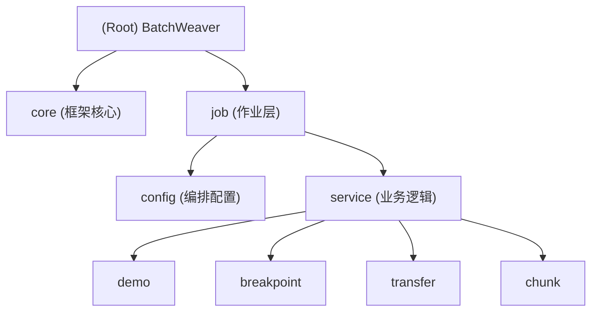

# BatchWeaver Project Guide

## 变更记录 (Changelog)
- **2026-01-15**: 新增高级执行控制功能（Advanced Control Job），支持 4 种执行模式
- **2026-01-15**: 初始化 CLAUDE.md 文档，梳理项目架构与开发规范。

## 项目愿景
BatchWeaver 是一个基于 **Spring Batch 5.0** 的动态批处理编排引擎。旨在提供类型安全、原生 Java 配置的批处理解决方案，支持复杂的条件流转、断点续传和高效的 Chunk 处理模式，集成 SQL Server 2022 作为元数据存储。

## 架构总览
项目采用标准 Spring Boot 分层架构，核心分为 Config 配置层（负责编排）与 Service 业务层（负责逻辑），通过 `DynamicJobRunner` 提供统一的作业调度入口。

### 模块结构图

## 模块索引

| 模块/目录 | 职责 | 关键路径 |
|---|---|---|
| **Root** | 项目入口、构建配置 | `pom.xml`, `README.md` |
| **Core** | 启动入口、动态调度器 | `src/main/java/com/example/batch/core` |
| **Core Execution** | 执行模式框架（注解、校验、构建） | `src/main/java/com/example/batch/core/execution` |
| **Job Config** | Job/Step 定义与编排 | `src/main/java/com/example/batch/job/config` |
| **Job Service** | 具体的业务处理逻辑 | `src/main/java/com/example/batch/job/service` |
| **Infrastructure** | 数据访问层（Mapper、Entity） | `src/main/java/com/example/batch/infrastructure` |
| **Config** | Spring 配置（数据源、Batch） | `src/main/java/com/example/batch/config` |

## 运行与开发

### 技术栈
- **Language**: Java 21
- **Framework**: Spring Boot 3.5.7, Spring Batch 5.x
- **Database**: SQL Server 2022
- **Build**: Maven

### 环境准备
1. 确保安装 JDK 21+ 和 Maven。
2. 配置 SQL Server 数据库，并执行 `scripts/init.sql` 初始化元数据表。
3. 修改 `src/main/resources/application.yml` 中的数据库连接信息。

### 常用命令
- **构建**: `mvn clean package -DskipTests`
- **运行 Demo**: `java -jar target/batch-weaver-0.0.1-SNAPSHOT.jar jobName=demoJob`
- **带参数运行**: `java -jar target/batch-weaver-0.0.1-SNAPSHOT.jar jobName=conditionalJob fail=true`
- **🆕 高级控制（断点续传）**: `java -jar target/batch-weaver-0.0.1-SNAPSHOT.jar jobName=advancedControlJob _mode=RESUME id=1001`
- **🆕 高级控制（跳过失败）**: `java -jar target/batch-weaver-0.0.1-SNAPSHOT.jar jobName=advancedControlJob _mode=SKIP_FAIL simulateFail=step3`
- **🆕 高级控制（独立 Step）**: `java -jar target/batch-weaver-0.0.1-SNAPSHOT.jar jobName=advancedControlJob _mode=ISOLATED _target_steps=advStep2`

## 测试策略
- **单元测试**: 使用 JUnit 5 和 Mockito 对 Service 层进行独立测试。
- **集成测试**: 使用 `@SpringBatchTest` 进行 Job 的端到端测试。
- **手动测试**: 提供了 `scripts/run-job.bat` (Windows) 和 `scripts/run-job.sh` (Linux) 辅助脚本。

## 编码规范
- **配置分离**: Job 编排逻辑（Config）与业务逻辑（Service）必须严格分离。
- **参数传递**: 禁止使用全局变量，必须通过 `JobParameters` 或 `ExecutionContext` 在 Step 间传递数据。
- **异常处理**: 显式定义可重试异常和跳过策略。

## AI 使用指引
- **代码生成**: 生成新 Job 时，请遵循 `job/config` 下的 Java Configuration 风格。
- **文档更新**: 修改 Job 逻辑后，请同步更新 `doc/` 下的相关文档。
