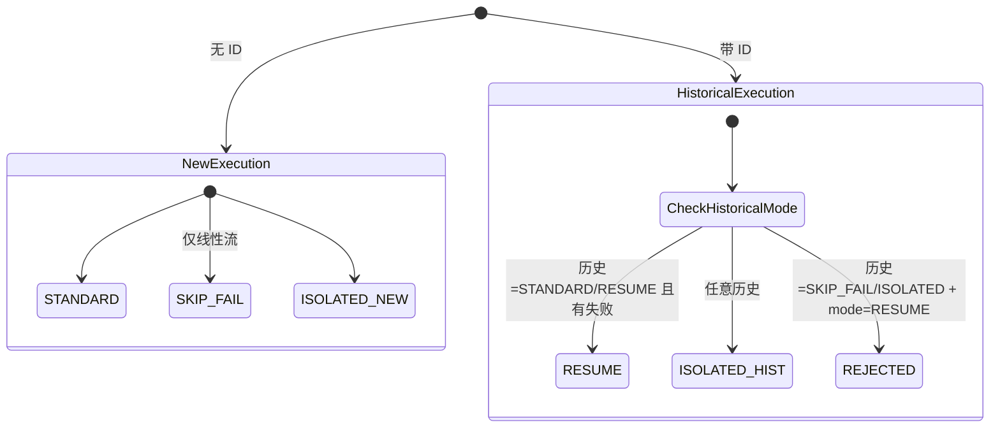

# BatchWeaver 执行模式语义规范

> 本文档是对四种执行模式的**语义标准说明**，用于对齐业务、运维和开发对 `_mode` 的统一理解。
> 实际约束由 `ExecutionModeValidator` 等运行时校验实现，文档与实现保持一一对应。

---

## 0. 概览与设计目标

BatchWeaver 在 Spring Batch 原生能力之上，提供了一个**框架级的执行模式体系**，所有 Job 都可以通过 `_mode` 参数统一使用四种模式：STANDARD、RESUME、SKIP_FAIL、ISOLATED。

- **目标**：在不破坏 Spring Batch 原生语义的前提下，提供更灵活的执行控制能力（断点续传、容错执行、独立 Step 修复）。
- **约束来源**：
  - 文档语义规范（本文件）；
  - 运行时校验 [`ExecutionModeValidator`](../src/main/java/com/example/batch/core/execution/ExecutionModeValidator.java)；
- **使用人群**：
  - 运维 / 调度：通过参数组合控制 Job 执行策略；
  - 开发：在实现 Job 时遵守模式约束，避免语义冲突。

---

## 1. STANDARD 模式

**用途**: 标准全流程执行（默认模式）

**前置条件**:
- JobInstance 不存在，或历史执行已完成（不区分成功/失败，由 Spring Batch 负责实例选择）；
- 不携带 `id` 参数。

**执行行为**:
- 按 Job 定义的完整流程（线性流 / 条件流）执行所有 Step；
- Step 失败时立即中断 Job，后续 Step 不再执行。

**失败语义**:
- 任一 Step 失败，则当前 JobExecution 状态为 `FAILED`；
- 失败状态与相关信息会记录到 Spring Batch 元数据表中，可被后续 RESUME / ISOLATED 使用。

**幂等性要求**: 无特别要求（通常用于“首次执行”场景）。

**示例**:
```bash
java -jar target/batch-weaver-0.0.1-SNAPSHOT.jar jobName=advancedControlJob
```

---

## 2. RESUME 模式

**用途**: 断点续传（从上次失败的 Step 继续）。

**前置条件**:
- 必须提供 `id` 参数（历史 JobExecution ID）；
- 该 JobExecution 必须存在；
- 该 JobExecution 的 `jobName` 必须与本次请求的 `jobName` 一致；
- 该 JobExecution 不得是 `COMPLETED` 且必须处于 `FAILED` 状态（只允许从 FAILED 状态续传）；
- 历史执行模式不为 `SKIP_FAIL` / `ISOLATED`（否则流程语义已被破坏）。

**执行行为**:
- 利用 Spring Batch 原生 restart 机制：
  - 自动跳过已 `COMPLETED` 的 Step；
  - 从第一个失败的 Step 开始继续执行后续 Step；
- 动态构建仅包含需要续传部分的线性 Flow，而不是重跑整个 Job。

**失败语义**:
- 再次失败则更新新的 JobExecution 状态；
- 历史 JobExecution 会保留原始失败记录，便于审计和排查。

**幂等性要求**: 高
- 业务逻辑必须支持重复执行失败 Step 及其后续 Step；
- 不允许修改 Job 结构（新增/删除/重命名 Step），否则续传路径将与历史执行不匹配。

**不允许的操作**:
- 缺少 `id` 参数；
- 指定的 `id` 不存在；
- 指定的 `id` 属于其他 `jobName`；
- 指定的 JobExecution 状态不是 `FAILED`；
- 历史执行的 `_mode` 为 `SKIP_FAIL` 或 `ISOLATED`。

**示例**:
```bash
# 第一次执行（模拟失败）
java -jar target/batch-weaver-0.0.1-SNAPSHOT.jar \
  jobName=advancedControlJob simulateFail=step3

# 查询失败的 Execution ID（从元数据表）
# SELECT JOB_EXECUTION_ID FROM BATCH_JOB_EXECUTION WHERE STATUS='FAILED';

# 第二次执行（续传）
java -jar target/batch-weaver-0.0.1-SNAPSHOT.jar \
  jobName=advancedControlJob _mode=RESUME id=<查询到的ID>
```

---

## 3. SKIP_FAIL 模式

**用途**: 容错执行（遇到失败跳过继续）。

**前置条件**:
- Job 通过 `@BatchJob` 声明元数据；
- Job 为线性流（`conditionalFlow=false`），不支持条件流 Job；
- 不携带 `id` 参数（仅创建新执行）。

**执行行为**:
- 按 `steps` 列表构建容错 Flow：
  - 对每个 Step，无论 `COMPLETED` 还是 `FAILED`，都继续流转到下一个 Step；
  - 最后一个 Step 即使失败，也将 Job 标记为 `COMPLETED`；
- 通过专用监听器输出汇总日志，列出哪些 Step 失败但被跳过。

**失败语义**:
- Job 最终状态为 `COMPLETED`，但 ExitStatus 会携带“with skipped failures” 描述；
- 失败 Step 在日志和元数据中有记录，方便后续修复。

**幂等性要求**: 中
- 适用于业务上允许“部分成功”的场景；
- 下游系统需要能够识别并处理被跳过的失败 Step（例如后续通过 ISOLATED 进行修补）。

**不允许的操作**:
- 携带 `id` 参数；
- 在条件流 Job 上使用（会被运行时校验拒绝）。

**示例**:
```bash
java -jar target/batch-weaver-0.0.1-SNAPSHOT.jar \
  jobName=advancedControlJob _mode=SKIP_FAIL simulateFail=step3
```

---

## 4. ISOLATED 模式

**用途**: 独立执行指定 Step（含数据修补、调试等场景）。

**前置条件**:
- 必须提供 `_target_steps` 参数（逗号分隔的 Step 名称列表）；
- 若 Job 通过 `@BatchJob` 声明元数据，则 `_target_steps` 中每个 Step 名称必须在该 Job 的合法 Step 列表内；
- 携带 `id` 参数时，`id` 对应的 JobExecution 必须存在且 `jobName` 匹配（用于加载历史 ExecutionContext）。

**执行行为**:
- 按 `_target_steps` 列表的顺序线性执行指定 Step，忽略原有 Job 定义中的条件流转关系；
- 如携带 `id` 参数，则会在执行前加载历史 Job/Step 的 ExecutionContext，支持基于历史上下文的精细修复；
- 不论某个 Step 成功/失败，不影响其他指定 Step 的执行。

**失败语义**:
- 某个 Step 失败只影响该 Step 的结果，不会阻断其他 `_target_steps` 的执行；
- Job 最终状态由 Spring Batch 根据 Step 执行结果综合判定，具体含义需结合 Execution Summary 日志查看。

**幂等性要求**: 视业务场景而定
- 常用于“只重跑某一步”或“基于历史上下文做精修”的场景；
- 建议业务层自行保证同一 Step 多次执行的幂等性，或通过额外校验避免重复处理。

**不允许的操作**:
- `_target_steps` 为空或包含无效 Step 名称（对已注册 Job 会在运行前被校验拒绝）。

**示例**:
```bash
# 无 ID：按指定 Step 列表直接执行
java -jar target/batch-weaver-0.0.1-SNAPSHOT.jar \
  jobName=advancedControlJob _mode=ISOLATED _target_steps=advStep2,advStep3

# 携带 ID：在指定历史上下文基础上执行部分 Step
java -jar target/batch-weaver-0.0.1-SNAPSHOT.jar \
  jobName=advancedControlJob _mode=ISOLATED id=<历史ID> _target_steps=advStep3
```

---

## 5. 框架架构与关键组件

- **ExecutionMode**：枚举四种执行模式及其基础语义。
- **BatchJob 注解**：在 Job 配置类上声明 Job 名称、Step 列表以及是否为条件流 Job，仅用于提供元数据。
- **JobMetadataRegistry**：在启动时扫描 `@BatchJob`，构建 Job 元数据注册表（合法 Step 列表、是否条件流）。
- **ExecutionStatusService**：封装对 Spring Batch 元数据表的查询（历史执行、失败 Step、续传起点等）。
- **ExecutionModeValidator**：执行模式语义校验的唯一入口，根据 `_mode`、`id`、`_target_steps` 等参数做规则校验。
- **DynamicJobBuilderService**：根据执行模式动态构建 Job/Flow（续传 Flow、容错 Flow、独立 Flow 等）。

这些组件全部位于 `com.example.batch.core` 下，独立于具体业务 Job，可被所有示例 Job 复用。

---

## 6. 决策流程与状态机图

### 6.1 执行模式决策流程

```mermaid
flowchart TD
    Start([开始]) --> ParseParams["解析参数<br/>jobName, _mode, id, _target_steps"]
    ParseParams --> CheckMode{_mode?}
    
    CheckMode -->|STANDARD| StdCheck{"携带 ID?"}
    CheckMode -->|RESUME| ResCheck{"携带 ID?"}
    CheckMode -->|SKIP_FAIL| SkipCheck{"携带 ID?"}
    CheckMode -->|ISOLATED| IsoCheck{"携带 _target_steps?"}
    CheckMode -->|未指定| StdCheck
    
    StdCheck -->|是| RejectStd["拒绝: STANDARD 不能带 ID"]
    StdCheck -->|否| ExecStd["执行原生 Job Flow"]
    
    ResCheck -->|否| RejectRes["拒绝: RESUME 必须带 ID"]
    ResCheck -->|是| CheckHistory{"查询历史模式"]
    CheckHistory -->|SKIP_FAIL/ISOLATED| RejectResHist["拒绝: 流程已破坏"]
    CheckHistory -->|STANDARD/RESUME| CheckFailed{"有失败 Step?"}
    CheckFailed -->|否| RejectNoFail["拒绝: 无需续传"]
    CheckFailed -->|是| ExecRes["构建续传 Flow<br/>从失败 Step 开始"]
    
    SkipCheck -->|是| RejectSkip["拒绝: SKIP_FAIL 不能带 ID"]
    SkipCheck -->|否| CheckCond{"条件流 Job?"}
    CheckCond -->|是| RejectCond["拒绝: 条件流不支持 SKIP_FAIL"]
    CheckCond -->|否| ExecSkip["构建容错 Flow<br/>失败跳过继续"]
    
    IsoCheck -->|否| RejectIso["拒绝: 缺少 _target_steps"]
    IsoCheck -->|是| ValidateSteps{"校验 Step 名称"]
    ValidateSteps -->|无效| RejectStep["拒绝: 无效 Step 名称"]
    ValidateSteps -->|有效| ExecIso["构建指定 Step Flow"]
    
    ExecStd --> Launch["JobLauncher.run()"]; 
    ExecRes --> Launch
    ExecSkip --> Launch
    ExecIso --> Launch
    
    Launch --> End([结束])
```

### 6.2 模式状态转换图（简化）



