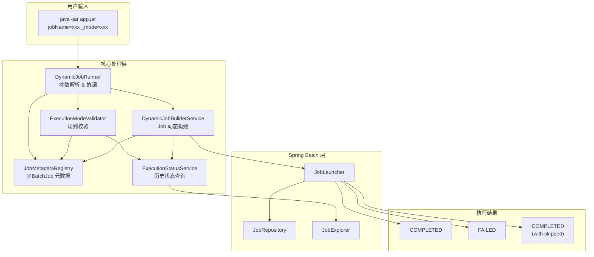
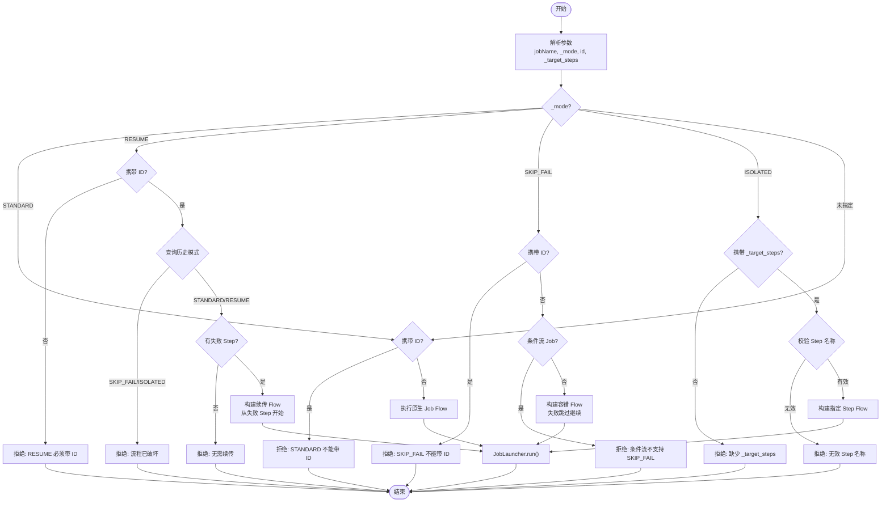
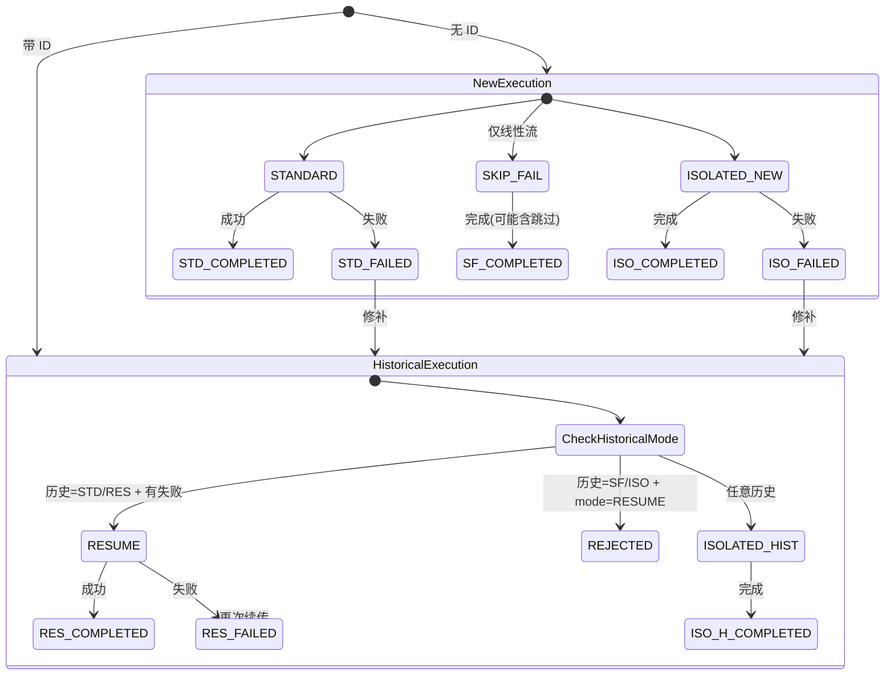
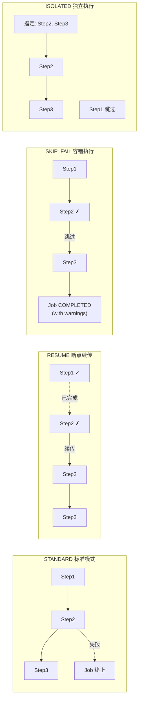
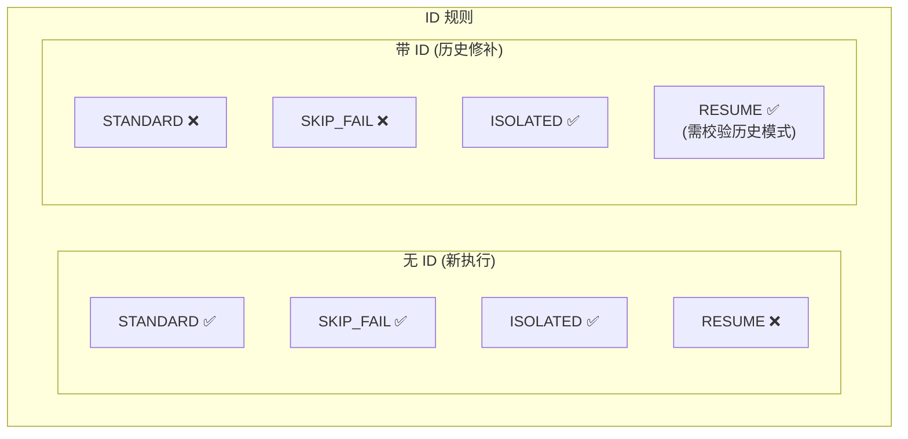
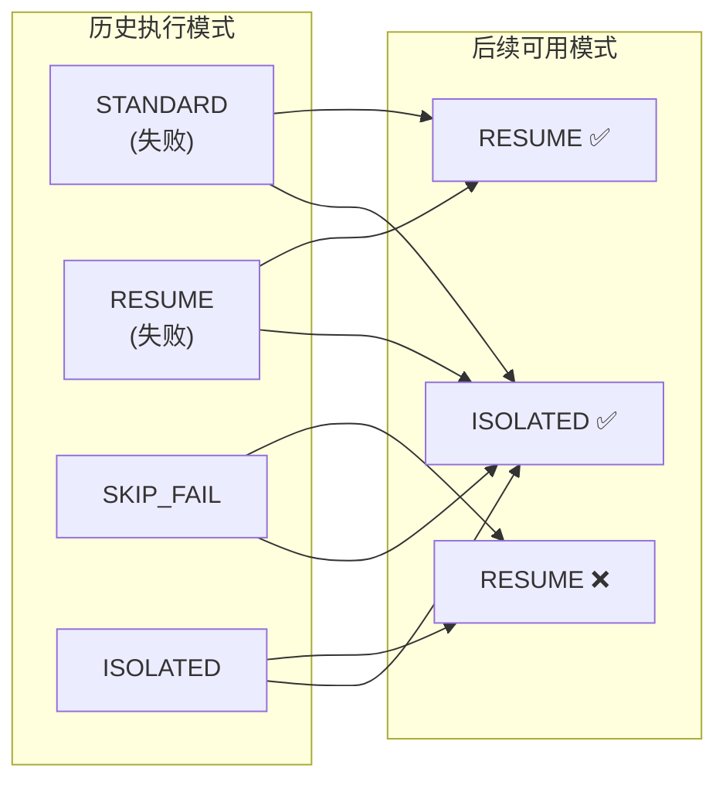
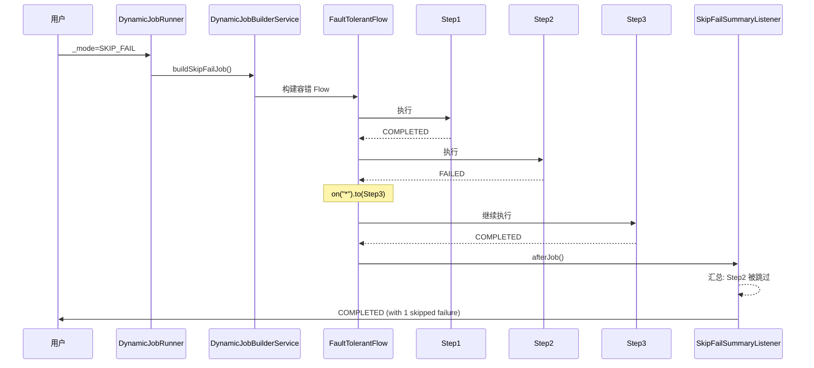
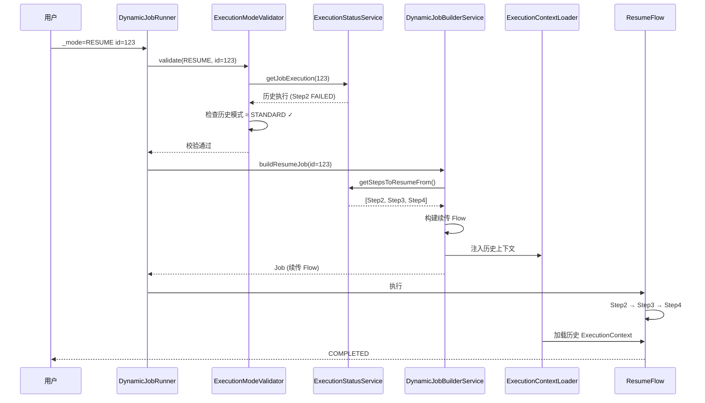
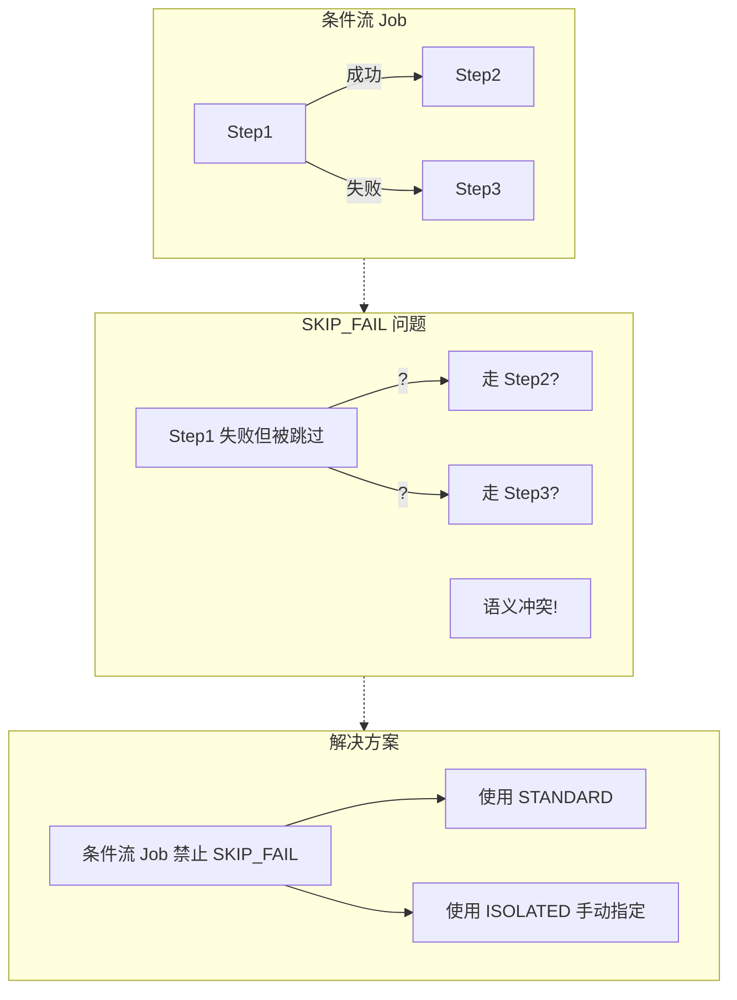

# 执行模式流程图

本文档通过 Mermaid 图表展示 BatchWeaver 四种执行模式的工作流程和状态转换。

---

## 1. 整体架构流程

---

## 2. 执行模式决策流程

---

## 3. 模式状态转换图

---

## 4. 四种模式对比

---

## 5. ID 规则矩阵

---

## 6. 模式后续限制

---

## 7. SKIP_FAIL 容错流程详解

---

## 8. RESUME 断点续传详解

---

## 9. 条件流限制说明

---

## 快速参考

| 模式 | ID 规则 | 线性流 | 条件流 | 典型场景 |
|------|---------|--------|--------|---------|
| **STANDARD** | 不能带 | ✅ | ✅ | 常规执行 |
| **RESUME** | 必须带 | ✅ | ✅ | 失败后续传 |
| **SKIP_FAIL** | 不能带 | ✅ | ❌ | 容错推进 |
| **ISOLATED** | 可选 | ✅ | ✅ | 数据修复 |
