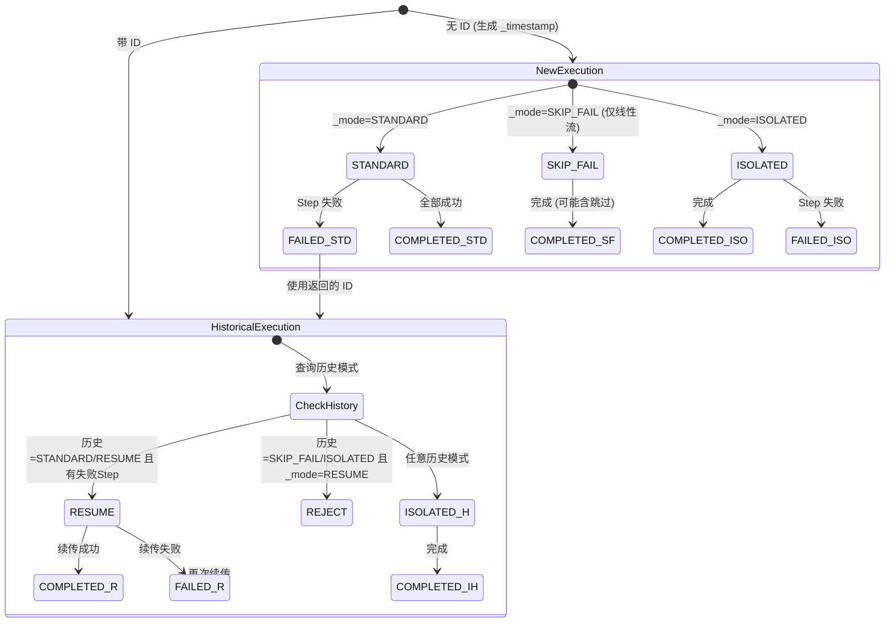

# BatchWeaver 执行模式框架设计需求

## 1. 设计目标

将执行模式控制从特定 Job 绑定升级为**框架级通用能力**，任意 Job 均可通过参数使用 4 种执行模式。

## 2. 核心原则

### 2.1 事务边界

| 层面 | 事务范围 | 说明 |
|------|---------|------|
| **业务数据** | Step 级别 | 每个 Step 独立事务，失败回滚当前 Step |
| **元数据** | 独立于 Step | 不受业务事务约束，始终记录执行状态 |

### 2.2 ID 语义

| 是否携带 ID | 语义 |
|------------|------|
| 不携带 ID | **创建**新的 Job 执行，系统自动生成 Execution ID |
| 携带 ID | **修补**历史执行，关联到指定 Execution ID |

---

## 3. 四种执行模式详细规格

### 3.1 STANDARD 模式（标准编排）

**定位**：基准模式，严格按 Job 定义的原生流程执行

| 参数 | 行为 |
|------|------|
| 不带 ID | 创建新执行，按原生流程（线性/条件流）顺序执行所有 Step |
| 带 ID | **拒绝执行**，提示使用 RESUME 或 ISOLATED |

**ID 规则**：不能带 ID（只能创建新执行）

**适用 Job 类型**：线性流 ✅ 条件流 ✅

---

### 3.2 RESUME 模式（断点续传）

**定位**：对 STANDARD 的补救，利用 Spring Batch 原生重启机制从失败 Step 继续执行

| 参数 | 行为 |
|------|------|
| 不带 ID | **拒绝执行**，提示必须携带历史 Execution ID |
| 带 ID | 查询历史状态：<br>- 已完成无异常 → 提示无需续传<br>- 历史模式为 SKIP_FAIL/ISOLATED → **拒绝执行**<br>- 有失败 Step → 从第一个失败 Step 开始续传 |

**适用 Job 类型**：线性流 ✅ 条件流 ✅

**条件流处理**：历史执行已确定分支路径，RESUME 直接从失败 Step 继续，无需重新判断条件

---

### 3.3 SKIP_FAIL 模式（容错执行）

**定位**：特殊模式，遇到失败跳过继续推进（破坏原有流程语义）

| 参数 | 行为 |
|------|------|
| 不带 ID | 创建新执行，按线性顺序执行，Step 失败标记为 SKIPPED 继续下一个 |
| 带 ID | **拒绝执行**，提示使用 RESUME 或 ISOLATED |

**ID 规则**：不能带 ID（只能创建新执行）

**适用 Job 类型**：线性流 ✅ 条件流 ❌

**条件流限制原因**：
```
条件流：step1 失败 → 走 step3
SKIP_FAIL：step1 失败但跳过 → 应该走 step2 还是 step3？
           语义冲突，无法决定
```

**最终状态**：`COMPLETED (with warnings)`，汇总中标注被跳过的 Step

**后续限制**：执行 SKIP_FAIL 后，该 ID 不能再使用 RESUME 模式

---

### 3.4 ISOLATED 模式（独立执行）

**定位**：特殊模式，完全破坏原有流程，手动指定执行特定 Step

| 参数 | 行为 |
|------|------|
| 不带 ID | 创建新执行，按 `_target_steps` 指定顺序线性执行 |
| 带 ID | 基于历史执行上下文，执行 `_target_steps` 指定的 Step |

**必需参数**：`_target_steps`（逗号分隔的 Step 名称）

**适用 Job 类型**：线性流 ✅ 条件流 ✅（完全忽略原有条件逻辑）

**执行特点**：
- 按 `_target_steps` 顺序线性执行
- 无论 Step 成功/失败，不影响其他指定 Step 的执行
- 用户自担风险

**后续限制**：执行 ISOLATED 后，该 ID 不能再使用 RESUME 模式，但可以继续使用 ISOLATED

---

## 4. 模式规则汇总矩阵

### 4.1 模式 × Job 类型

| 模式 | 线性流 | 条件流 | ID 规则 | 失败处理 |
|------|--------|--------|---------|---------|
| STANDARD | ✅ | ✅ | **不能带 ID** | 失败即停止 |
| RESUME | ✅ | ✅ | **必须带 ID** | 从第一个失败 Step 续传 |
| SKIP_FAIL | ✅ | ❌ 拒绝 | **不能带 ID** | 跳过失败继续 |
| ISOLATED | ✅ | ✅ | 带/不带均可 | 按指定 Step 线性执行 |

### 4.2 模式后续限制

| 历史执行模式 | 后续可用 RESUME(带ID)? | 后续可用 ISOLATED(带ID)? |
|-------------|----------------------|------------------------|
| STANDARD (失败) | ✅ 可以 | ✅ 可以 |
| RESUME (失败) | ✅ 可以 | ✅ 可以 |
| SKIP_FAIL | ❌ 拒绝 | ✅ 可以 |
| ISOLATED | ❌ 拒绝 | ✅ 可以 |

**原因**：SKIP_FAIL 和 ISOLATED 破坏了原有流程语义，RESUME 依赖原有流程，所以不能再用

### 4.3 执行模式状态转换图



**状态说明**：

| 状态 | 含义 |
|------|------|
| `NewExecution` | 新执行（无历史 ID） |
| `HistoricalExecution` | 基于历史执行（带 ID） |
| `REJECT` | 校验拒绝（不允许的模式转换） |
| `COMPLETED_*` | 执行完成 |
| `FAILED_*` | 执行失败，可进入 `HistoricalExecution` 修补 |

**关键转换规则**：

```
STANDARD (失败) ──RESUME──> 可以续传
STANDARD (失败) ──ISOLATED──> 可以独立修补

SKIP_FAIL ──RESUME──> ❌ 禁止（流程已破坏）
SKIP_FAIL ──ISOLATED──> ✅ 可以独立修补

ISOLATED ──RESUME──> ❌ 禁止（流程已破坏）
ISOLATED ──ISOLATED──> ✅ 可以继续独立执行
```

---

## 5. 框架架构设计

### 5.1 注解定义

```java
@Target(ElementType.TYPE)
@Retention(RetentionPolicy.RUNTIME)
@Documented
public @interface BatchJob {
    
    /**
     * Job 名称（与 @Bean 定义的 Job 名称一致）
     */
    String name();
    
    /**
     * Step 名称列表（仅用于 ISOLATED 模式校验 _target_steps 合法性）
     * 不关心顺序，只需列出该 Job 中所有可用的 Step
     */
    String[] steps();
    
    /**
     * 是否为条件流 Job（默认 false = 线性流）
     * 条件流 Job 不支持 SKIP_FAIL 模式
     */
    boolean conditionalFlow() default false;
}
```

### 5.2 Job 配置类使用示例

```java
// 线性流 Job
@Configuration
@BatchJob(name = "demoJob", steps = {"importStep", "updateStep", "exportStep"})
public class DemoJobConfig {
    // 原有 @Bean 定义保持不变...
}

// 条件流 Job
@Configuration
@BatchJob(name = "conditionalJob", steps = {"step1", "step2", "step3"}, conditionalFlow = true)
public class ConditionalJobConfig {
    // 原有 @Bean 定义保持不变...
}
```

### 5.3 新增/修改组件

```
com.example.batch.core.execution
├── ExecutionMode.java              # 已有，无需修改
├── BatchJob.java                   # 新增：Job 元数据注解
├── JobMetadataRegistry.java        # 新增：扫描收集 @BatchJob 注解
├── ExecutionModeValidator.java     # 新增：模式校验（条件流、模式后续限制等）
├── DynamicJobBuilderService.java   # 重构：移除硬编码，通用化
└── ExecutionStatusService.java     # 已有，新增查询历史模式方法
```

### 5.4 JobMetadataRegistry 实现

```java
@Service
public class JobMetadataRegistry {
    
    private final Map<String, BatchJob> registry = new HashMap<>();
    
    public JobMetadataRegistry(ApplicationContext context) {
        // 扫描所有带 @BatchJob 注解的配置类
        context.getBeansWithAnnotation(BatchJob.class)
            .values()
            .forEach(bean -> {
                BatchJob annotation = bean.getClass().getAnnotation(BatchJob.class);
                registry.put(annotation.name(), annotation);
            });
    }
    
    public BatchJob get(String jobName) {
        return registry.get(jobName);
    }
    
    public boolean isRegistered(String jobName) {
        return registry.containsKey(jobName);
    }
}
```

### 5.5 执行流程

```
用户命令
   │
   ▼
DynamicJobRunner
   │
   ├─ 解析 jobName, _mode, id, _target_steps
   │
   ▼
JobMetadataRegistry.get(jobName)
   │
   ├─ 未注册 → 只允许 STANDARD 模式（原生执行）
   │
   ▼
ExecutionModeValidator.validate(mode, metadata, id, historicalExecution)
   │
   ├─ STANDARD + 带 ID → 拒绝
   ├─ RESUME + 无 ID → 拒绝
   ├─ RESUME + 历史模式为 SKIP_FAIL/ISOLATED → 拒绝
   ├─ SKIP_FAIL + 带 ID → 拒绝
   ├─ SKIP_FAIL + 条件流 → 拒绝
   ├─ ISOLATED + 无 _target_steps → 拒绝
   ├─ ISOLATED + 无效 Step 名称 → 拒绝
   │
   ▼
执行策略决定
   │
   ├─ STANDARD → 使用原生 Job Bean
   ├─ RESUME → 利用 Spring Batch 原生重启机制
   ├─ SKIP_FAIL → 使用原生 Job Bean + 容错 StepExecutionListener
   ├─ ISOLATED → 动态构建只包含指定 Step 的 Flow
   │
   ▼
JobLauncher.run(job, params)
   │
   ▼
元数据记录（独立事务，记录 _mode 参数）
```

---

## 6. 参数规格

### 6.1 保留参数（以 `_` 开头）

| 参数 | 类型 | 说明 |
|------|------|------|
| `_mode` | String | 执行模式：STANDARD/RESUME/SKIP_FAIL/ISOLATED |
| `_target_steps` | String | ISOLATED 模式必需，逗号分隔的 Step 名称 |

### 6.2 通用参数

| 参数 | 类型 | 说明 |
|------|------|------|
| `jobName` | String | 必需，要执行的 Job 名称 |
| `id` | Long | 可选，历史 Execution ID（修补时使用） |

---

## 7. 错误处理规格

| 场景 | 错误信息 |
|------|---------|
| STANDARD 带 ID | `STANDARD mode does not accept 'id' parameter. Use RESUME or ISOLATED for historical executions.` |
| RESUME 无 ID | `RESUME mode requires 'id' parameter. Query failed execution ID from metadata table.` |
| RESUME 历史为 SKIP_FAIL | `Cannot RESUME after SKIP_FAIL execution (id=xxx). Use ISOLATED mode instead.` |
| RESUME 历史为 ISOLATED | `Cannot RESUME after ISOLATED execution (id=xxx). Use ISOLATED mode instead.` |
| SKIP_FAIL 带 ID | `SKIP_FAIL mode does not accept 'id' parameter. Use RESUME or ISOLATED for historical executions.` |
| SKIP_FAIL + 条件流 | `SKIP_FAIL mode is not supported for conditional flow jobs. Use STANDARD or ISOLATED.` |
| ISOLATED 无 _target_steps | `ISOLATED mode requires '_target_steps' parameter.` |
| 无效 Step 名称 | `Invalid step name 'xxx'. Valid steps for job 'yyy': [...]` |
| ID 不存在 | `No execution found for id=xxx.` |
| 已完成 Job 执行 RESUME | `Job already completed successfully. No steps to resume.` |
| Job 未注册 + 非 STANDARD 模式 | `Job 'xxx' does not support advanced execution modes. Add @BatchJob annotation to enable.` |

---

## 8. 元数据存储

### 8.1 执行模式记录

每次执行时，将 `_mode` 参数存储到 `BATCH_JOB_EXECUTION_PARAMS` 表：

| 字段 | 值 |
|------|------|
| JOB_EXECUTION_ID | 当前执行 ID |
| PARAMETER_NAME | `_mode` |
| PARAMETER_TYPE | `STRING` |
| PARAMETER_VALUE | `STANDARD` / `RESUME` / `SKIP_FAIL` / `ISOLATED` |

### 8.2 查询历史模式

```java
public String getHistoricalMode(Long executionId) {
    JobExecution execution = jobExplorer.getJobExecution(executionId);
    return execution.getJobParameters().getString("_mode", "STANDARD");
}
```

---

## 9. SKIP_FAIL 步骤状态

根据 Spring Batch 规范，SKIP_FAIL 模式下被跳过的 Step：
- **状态**：`COMPLETED`（不是 ABANDONED）
- **ExitStatus**：添加 `SKIPPED` 描述说明
- **原因**：ABANDONED 通常表示人工放弃，不适用于自动容错场景
