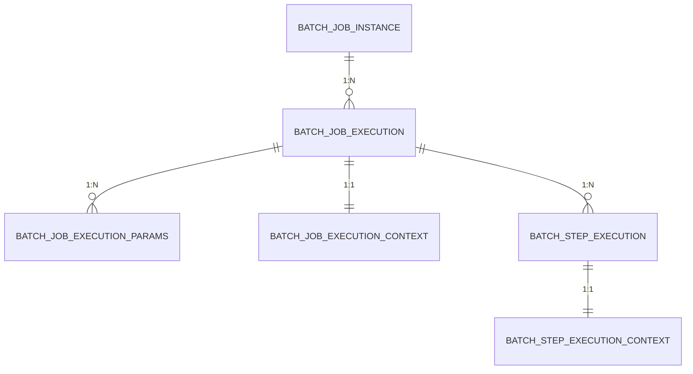

# Spring Batch 元数据表说明

## 概述
Spring Batch 使用 6 张核心元数据表来管理 Job 的执行状态、参数、上下文等信息。这些表是 Spring Batch 框架实现断点续传、失败重试、执行监控等功能的基础。

## 表结构关系图



## 核心表详解

### 1. BATCH_JOB_INSTANCE（Job 实例表）

**作用**: 存储 Job 的唯一实例信息，一个 Job 配置对应一个实例。

| 字段名 | 类型 | 说明 |
|--------|------|------|
| JOB_INSTANCE_ID | BIGINT | Job 实例 ID（主键） |
| VERSION | BIGINT | 版本号，用于乐观锁控制 |
| JOB_NAME | NVARCHAR(100) | Job 名称，如 `demoJob` |
| JOB_KEY | NVARCHAR(32) | Job 唯一标识 Key，由 Job 名称和参数生成的哈希值 |

**关键概念**:
- **Job Instance** = Job Name + Identifying Parameters
- 相同的 Job 名称和参数只会创建一个 Instance
- `JOB_KEY` 是通过参数序列化后计算的 MD5 哈希值

**示例查询**:
```sql
-- 查看所有 Job 实例
SELECT JOB_INSTANCE_ID, JOB_NAME, JOB_KEY 
FROM BATCH_JOB_INSTANCE 
ORDER BY JOB_INSTANCE_ID DESC;
```

---

### 2. BATCH_JOB_EXECUTION（Job 执行表）

**作用**: 记录每次 Job 的执行情况，一个实例可以有多次执行（失败重试）。

| 字段名 | 类型 | 说明 |
|--------|------|------|
| JOB_EXECUTION_ID | BIGINT | Job 执行 ID（主键） |
| VERSION | BIGINT | 版本号 |
| JOB_INSTANCE_ID | BIGINT | 关联的 Job 实例 ID（外键） |
| CREATE_TIME | DATETIME | 创建时间 |
| START_TIME | DATETIME | 开始执行时间 |
| END_TIME | DATETIME | 执行结束时间 |
| STATUS | NVARCHAR(10) | 执行状态 |
| EXIT_CODE | NVARCHAR(2500) | 退出码 |
| EXIT_MESSAGE | NVARCHAR(2500) | 退出消息，记录异常信息或执行结果 |
| LAST_UPDATED | DATETIME | 最后更新时间 |

**STATUS 状态值**:
- `STARTING`: 正在启动
- `STARTED`: 已启动，正在执行
- `COMPLETED`: 执行成功
- `FAILED`: 执行失败
- `STOPPED`: 被手动停止
- `ABANDONED`: 已放弃（不会再重启）

**示例查询**:
```sql
-- 查看最近的 Job 执行记录
SELECT 
    je.JOB_EXECUTION_ID,
    ji.JOB_NAME,
    je.STATUS,
    je.START_TIME,
    je.END_TIME,
    DATEDIFF(SECOND, je.START_TIME, je.END_TIME) AS DURATION_SECONDS,
    je.EXIT_MESSAGE
FROM BATCH_JOB_EXECUTION je
JOIN BATCH_JOB_INSTANCE ji ON je.JOB_INSTANCE_ID = ji.JOB_INSTANCE_ID
ORDER BY je.JOB_EXECUTION_ID DESC;
```

---

### 3. BATCH_JOB_EXECUTION_PARAMS（Job 执行参数表）

**作用**: 存储每次 Job 执行时传入的参数。

| 字段名 | 类型 | 说明 |
|--------|------|------|
| JOB_EXECUTION_ID | BIGINT | 关联的 Job 执行 ID（外键） |
| PARAMETER_NAME | NVARCHAR(100) | 参数名称 |
| PARAMETER_TYPE | NVARCHAR(100) | 参数类型：STRING/LONG/DATE/DOUBLE |
| PARAMETER_VALUE | NVARCHAR(2500) | 参数值 |
| IDENTIFYING | CHAR(1) | 是否为标识参数：Y/N |

**IDENTIFYING 字段说明**:
- `Y`: 标识参数，用于区分不同的 Job 实例
- `N`: 非标识参数，不影响 Job 实例的唯一性

**示例查询**:
```sql
-- 查看某次执行的所有参数
SELECT 
    PARAMETER_NAME,
    PARAMETER_TYPE,
    PARAMETER_VALUE,
    IDENTIFYING
FROM BATCH_JOB_EXECUTION_PARAMS
WHERE JOB_EXECUTION_ID = 1
ORDER BY PARAMETER_NAME;
```

---

### 4. BATCH_STEP_EXECUTION（Step 执行表）

**作用**: 记录每个 Step 的执行情况和统计信息。

| 字段名 | 类型 | 说明 |
|--------|------|------|
| STEP_EXECUTION_ID | BIGINT | Step 执行 ID（主键） |
| VERSION | BIGINT | 版本号 |
| STEP_NAME | NVARCHAR(100) | Step 名称 |
| JOB_EXECUTION_ID | BIGINT | 关联的 Job 执行 ID（外键） |
| CREATE_TIME | DATETIME | 创建时间 |
| START_TIME | DATETIME | 开始执行时间 |
| END_TIME | DATETIME | 执行结束时间 |
| STATUS | NVARCHAR(10) | 执行状态（同 Job） |
| COMMIT_COUNT | BIGINT | 提交次数（事务提交的次数） |
| READ_COUNT | BIGINT | 读取记录数 |
| FILTER_COUNT | BIGINT | 过滤记录数（被 Processor 过滤掉的） |
| WRITE_COUNT | BIGINT | 写入记录数 |
| READ_SKIP_COUNT | BIGINT | 读取跳过数（读取时异常跳过） |
| WRITE_SKIP_COUNT | BIGINT | 写入跳过数（写入时异常跳过） |
| PROCESS_SKIP_COUNT | BIGINT | 处理跳过数（处理时异常跳过） |
| ROLLBACK_COUNT | BIGINT | 回滚次数 |
| EXIT_CODE | NVARCHAR(2500) | 退出码 |
| EXIT_MESSAGE | NVARCHAR(2500) | 退出消息 |
| LAST_UPDATED | DATETIME | 最后更新时间 |

**示例查询**:
```sql
-- 查看某个 Job 的所有 Step 执行情况
SELECT 
    se.STEP_NAME,
    se.STATUS,
    se.READ_COUNT,
    se.WRITE_COUNT,
    se.COMMIT_COUNT,
    se.ROLLBACK_COUNT,
    DATEDIFF(SECOND, se.START_TIME, se.END_TIME) AS DURATION_SECONDS
FROM BATCH_STEP_EXECUTION se
WHERE se.JOB_EXECUTION_ID = 1
ORDER BY se.STEP_EXECUTION_ID;
```

---

### 5. BATCH_STEP_EXECUTION_CONTEXT（Step 执行上下文表）

**作用**: 存储 Step 执行过程中的上下文数据，用于断点续传。

| 字段名 | 类型 | 说明 |
|--------|------|------|
| STEP_EXECUTION_ID | BIGINT | 关联的 Step 执行 ID（主键、外键） |
| SHORT_CONTEXT | NVARCHAR(2500) | 短上下文，存储简短的上下文信息 |
| SERIALIZED_CONTEXT | NVARCHAR(MAX) | 序列化上下文，存储完整的序列化上下文数据 |

**用途**:
- 保存 Step 执行过程中的状态信息（如当前处理到第几条记录）
- 失败重启时，从上下文中恢复状态，实现断点续传

**示例查询**:
```sql
-- 查看 Step 的上下文信息
SELECT 
    se.STEP_NAME,
    sec.SHORT_CONTEXT,
    sec.SERIALIZED_CONTEXT
FROM BATCH_STEP_EXECUTION_CONTEXT sec
JOIN BATCH_STEP_EXECUTION se ON sec.STEP_EXECUTION_ID = se.STEP_EXECUTION_ID
WHERE se.JOB_EXECUTION_ID = 1;
```

---

### 6. BATCH_JOB_EXECUTION_CONTEXT（Job 执行上下文表）

**作用**: 存储 Job 执行过程中的上下文数据，用于 Step 间数据共享。

| 字段名 | 类型 | 说明 |
|--------|------|------|
| JOB_EXECUTION_ID | BIGINT | 关联的 Job 执行 ID（主键、外键） |
| SHORT_CONTEXT | NVARCHAR(2500) | 短上下文 |
| SERIALIZED_CONTEXT | NVARCHAR(MAX) | 序列化上下文 |

**用途**:
- 在不同 Step 之间共享数据
- 保存 Job 级别的状态信息

**示例查询**:
```sql
-- 查看 Job 的上下文信息
SELECT 
    ji.JOB_NAME,
    jec.SHORT_CONTEXT,
    jec.SERIALIZED_CONTEXT
FROM BATCH_JOB_EXECUTION_CONTEXT jec
JOIN BATCH_JOB_EXECUTION je ON jec.JOB_EXECUTION_ID = je.JOB_EXECUTION_ID
JOIN BATCH_JOB_INSTANCE ji ON je.JOB_INSTANCE_ID = ji.JOB_INSTANCE_ID
WHERE je.JOB_EXECUTION_ID = 1;
```

---

## 常用查询示例

### 1. 查看所有失败的 Job
```sql
SELECT 
    ji.JOB_NAME,
    je.JOB_EXECUTION_ID,
    je.START_TIME,
    je.EXIT_MESSAGE
FROM BATCH_JOB_EXECUTION je
JOIN BATCH_JOB_INSTANCE ji ON je.JOB_INSTANCE_ID = ji.JOB_INSTANCE_ID
WHERE je.STATUS = 'FAILED'
ORDER BY je.START_TIME DESC;
```

### 2. 查看某个 Job 的执行历史
```sql
SELECT 
    je.JOB_EXECUTION_ID,
    je.STATUS,
    je.START_TIME,
    je.END_TIME,
    DATEDIFF(SECOND, je.START_TIME, je.END_TIME) AS DURATION_SECONDS
FROM BATCH_JOB_EXECUTION je
JOIN BATCH_JOB_INSTANCE ji ON je.JOB_INSTANCE_ID = ji.JOB_INSTANCE_ID
WHERE ji.JOB_NAME = 'demoJob'
ORDER BY je.START_TIME DESC;
```

### 3. 查看 Step 的详细统计信息
```sql
SELECT 
    ji.JOB_NAME,
    se.STEP_NAME,
    se.READ_COUNT,
    se.WRITE_COUNT,
    se.FILTER_COUNT,
    se.COMMIT_COUNT,
    se.ROLLBACK_COUNT,
    se.STATUS
FROM BATCH_STEP_EXECUTION se
JOIN BATCH_JOB_EXECUTION je ON se.JOB_EXECUTION_ID = je.JOB_EXECUTION_ID
JOIN BATCH_JOB_INSTANCE ji ON je.JOB_INSTANCE_ID = ji.JOB_INSTANCE_ID
WHERE ji.JOB_NAME = 'demoJob'
ORDER BY se.STEP_EXECUTION_ID DESC;
```

### 4. 清理历史数据（谨慎使用）
```sql
-- 删除 30 天前的执行记录
DECLARE @CutoffDate DATETIME = DATEADD(DAY, -30, GETDATE());

DELETE FROM BATCH_STEP_EXECUTION_CONTEXT 
WHERE STEP_EXECUTION_ID IN (
    SELECT se.STEP_EXECUTION_ID 
    FROM BATCH_STEP_EXECUTION se
    JOIN BATCH_JOB_EXECUTION je ON se.JOB_EXECUTION_ID = je.JOB_EXECUTION_ID
    WHERE je.CREATE_TIME < @CutoffDate
);

DELETE FROM BATCH_JOB_EXECUTION_CONTEXT 
WHERE JOB_EXECUTION_ID IN (
    SELECT JOB_EXECUTION_ID 
    FROM BATCH_JOB_EXECUTION 
    WHERE CREATE_TIME < @CutoffDate
);

DELETE FROM BATCH_STEP_EXECUTION 
WHERE JOB_EXECUTION_ID IN (
    SELECT JOB_EXECUTION_ID 
    FROM BATCH_JOB_EXECUTION 
    WHERE CREATE_TIME < @CutoffDate
);

DELETE FROM BATCH_JOB_EXECUTION_PARAMS 
WHERE JOB_EXECUTION_ID IN (
    SELECT JOB_EXECUTION_ID 
    FROM BATCH_JOB_EXECUTION 
    WHERE CREATE_TIME < @CutoffDate
);

DELETE FROM BATCH_JOB_EXECUTION 
WHERE CREATE_TIME < @CutoffDate;

-- 注意：不删除 BATCH_JOB_INSTANCE，保留 Job 实例信息
```

---

## 断点续传机制说明

### 工作原理
1. **Job 启动时**，Spring Batch 根据 `JobName` + `JobParameters` 计算 `JOB_KEY`
2. **查询 BATCH_JOB_INSTANCE**，检查是否存在相同的 `JOB_KEY`
3. **如果存在**：
   - 查询该实例的最后一次执行记录（`BATCH_JOB_EXECUTION`）
   - 如果状态为 `FAILED`，则进入重启模式
   - 从 `BATCH_STEP_EXECUTION` 中找到失败的 Step
   - 从 `BATCH_STEP_EXECUTION_CONTEXT` 中恢复上下文
   - 跳过已成功的 Step，从失败的 Step 继续执行
4. **如果不存在**：创建新的 Job 实例，从头开始执行

### 关键点
- **相同参数** = 同一个 `JOB_KEY` = 可以断点续传
- **不同参数** = 不同的 `JOB_KEY` = 创建新实例
- 上下文信息保存在 `EXECUTION_CONTEXT` 表中

## 上下文与参数传递
- Job 参数：来自 `BATCH_JOB_EXECUTION_PARAMS`，标识实例（如 `id`），只读。
- 运行时上下文：
  - `BATCH_JOB_EXECUTION_CONTEXT` 持久化 Job 级 `ExecutionContext`，用于跨 Step 共享。
  - `BATCH_STEP_EXECUTION_CONTEXT` 持久化 Step 级 `ExecutionContext`，用于失败恢复。
- 使用建议：
  - 在 Step 方法签名为 `method(StepContribution, ChunkContext)` 时，读取 `JobParameters` 与写入 `ExecutionContext`。
  - 传递对象需实现 `Serializable`，以便被持久化到 `*_CONTEXT` 表中。
- 代码示例（伪代码）：
```
var job = chunkContext.getStepContext().getStepExecution().getJobExecution();
var ctx = job.getExecutionContext();
var id = job.getJobParameters().getLong("id");
ctx.put("batchId", id);
ctx.put("payload", new SerializableDto(...));
```

---

## 最佳实践

### 1. 监控建议
- 定期检查 `FAILED` 状态的 Job
- 监控 `ROLLBACK_COUNT`，过高可能表示数据质量问题
- 关注 `DURATION`，识别性能瓶颈

### 2. 清理策略
- 定期清理历史执行记录（建议保留 30-90 天）
- 保留 `BATCH_JOB_INSTANCE` 表，避免重复执行
- 清理前做好备份

### 3. 参数设计
- **本框架策略**: 使用 `id` 作为核心标识参数。
- **创建新实例**: 不传 `id`（框架自动生成时间戳）或传新 `id`。
- **断点续传**: 必须传入与上次失败执行相同的 `id`。
- **避免冲突**: 尽量避免手动传入无意义的重复 ID，除非是为了重试。

### 4. 性能优化
- 为常用查询字段添加索引
- 定期分析执行计划
- 考虑分区表（数据量大时）

### 5. Chunk 指标与事务
- `COMMIT_COUNT`：表示该 Step 在运行期间的提交次数；chunk 模式下与提交批次数一致
- `READ_COUNT`/`WRITE_COUNT`：读写总条数；结合 `COMMIT_COUNT` 可估算平均每批大小
- `ROLLBACK_COUNT`：回滚次数；异常时仅影响当前批次，重跑可从最近提交处继续
- 观测建议：
  - 设置合理的 `commitInterval` 以平衡事务成本与检查点密度
  - 关注 `DURATION_SECONDS` 与 `COMMIT_COUNT`，识别长事务与吞吐瓶颈
