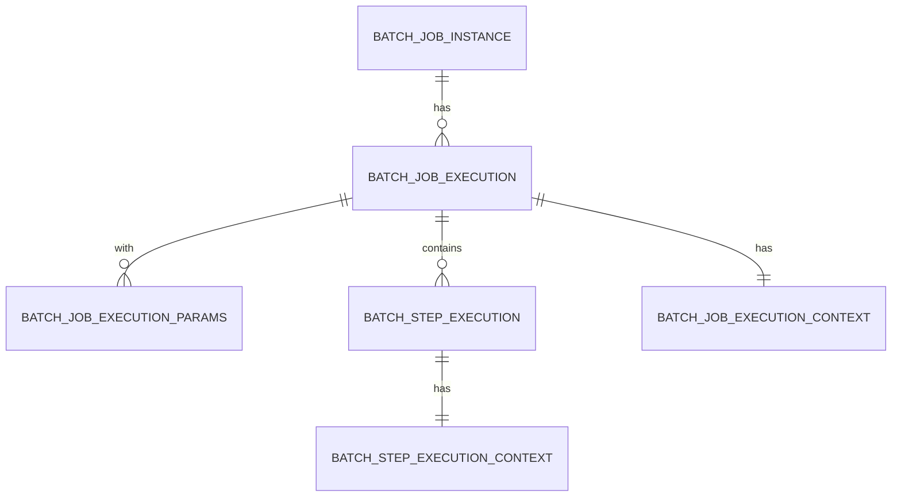
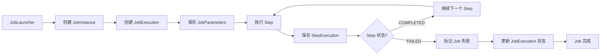
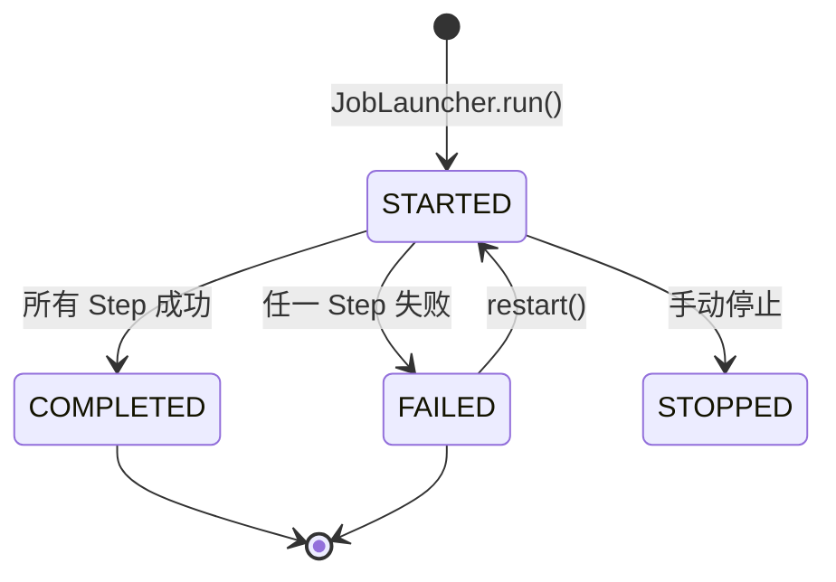
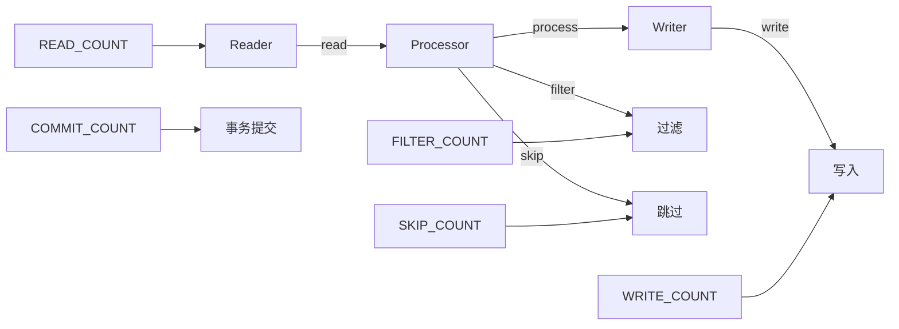
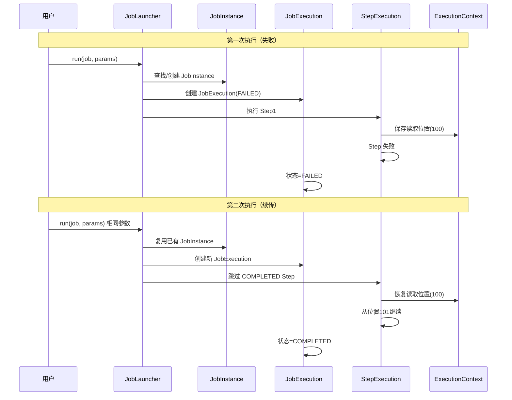
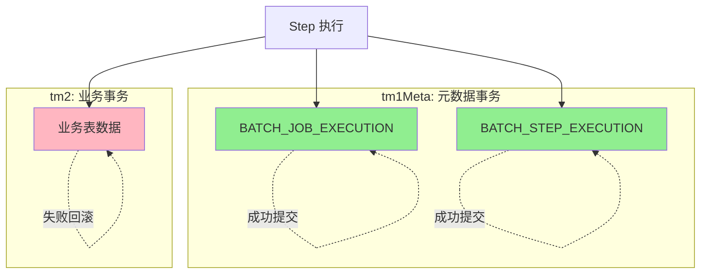

# Spring Batch 元数据表说明

> 本文档说明 Spring Batch 5.x 元数据表的结构、用途以及在 BatchWeaver 中的配置。

---

## 1. 概览

Spring Batch 使用元数据表来持久化 Job 执行状态，支持断点续传、执行历史查询、监控审计等功能。

### 1.1 元数据表列表

| 表名 | 用途 |
|------|------|
| `BATCH_JOB_INSTANCE` | Job 实例（同一个 Job 的逻辑执行） |
| `BATCH_JOB_EXECUTION` | Job 执行（每次物理执行） |
| `BATCH_JOB_EXECUTION_PARAMS` | Job 参数 |
| `BATCH_STEP_EXECUTION` | Step 执行 |
| `BATCH_STEP_EXECUTION_CONTEXT` | Step 上下文（持久化状态） |
| `BATCH_JOB_EXECUTION_CONTEXT` | Job 上下文（持久化状态） |

### 1.2 表关系图



### 1.3 执行流程图



---

## 2. 表结构详解

### 2.1 BATCH_JOB_INSTANCE

Job 实例表，记录 Job 的逻辑标识。

| 字段 | 类型 | 说明 |
|------|------|------|
| `JOB_INSTANCE_ID` | BIGINT | 主键，自增 |
| `VERSION` | BIGINT | 乐观锁版本号 |
| `JOB_NAME` | VARCHAR | Job 名称 |
| `JOB_KEY` | VARCHAR | Job 唯一键（基于参数生成） |

**核心概念**：
- 同一个 `JOB_NAME` + 相同的 `JOB_KEY` = 同一个 JobInstance
- `JOB_KEY` 由 JobParameters 的哈希值生成，确保相同参数对应同一实例

---

### 2.2 BATCH_JOB_EXECUTION

Job 执行表，记录每次物理执行。

| 字段 | 类型 | 说明 |
|------|------|------|
| `JOB_EXECUTION_ID` | BIGINT | 主键，自增 |
| `VERSION` | BIGINT | 乐观锁版本号 |
| `JOB_INSTANCE_ID` | BIGINT | 关联 JobInstance |
| `CREATE_TIME` | TIMESTAMP | 创建时间 |
| `START_TIME` | TIMESTAMP | 开始时间 |
| `END_TIME` | TIMESTAMP | 结束时间 |
| `STATUS` | VARCHAR | 执行状态（COMPLETED/FAILED/STARTED等） |
| `EXIT_CODE` | VARCHAR | 退出码 |
| `EXIT_MESSAGE` | VARCHAR | 退出消息 |
| `LAST_UPDATED` | TIMESTAMP | 最后更新时间 |

**状态流转**：



---

### 2.3 BATCH_JOB_EXECUTION_PARAMS

Job 参数表，记录每次执行的参数。

| 字段 | 类型 | 说明 |
|------|------|------|
| `JOB_EXECUTION_ID` | BIGINT | 关联 JobExecution |
| `KEY_NAME` | VARCHAR | 参数名 |
| `TYPE_CD` | VARCHAR | 参数类型（STRING/LONG/DATE等） |
| `STRING_VAL` | VARCHAR | 字符串值 |
| `LONG_VAL` | BIGINT | 长整型值 |
| `DOUBLE_VAL` | DOUBLE | 双精度值 |

**用途**：
- 区分不同的 JobInstance（相同参数 = 相同实例）
- 断点续传时恢复参数
- 审计执行历史

---

### 2.4 BATCH_STEP_EXECUTION

Step 执行表，记录每个 Step 的执行状态。

| 字段 | 类型 | 说明 |
|------|------|------|
| `STEP_EXECUTION_ID` | BIGINT | 主键，自增 |
| `VERSION` | BIGINT | 乐观锁版本号 |
| `STEP_NAME` | VARCHAR | Step 名称 |
| `JOB_EXECUTION_ID` | BIGINT | 关联 JobExecution |
| `START_TIME` | TIMESTAMP | 开始时间 |
| `END_TIME` | TIMESTAMP | 结束时间 |
| `STATUS` | VARCHAR | 执行状态 |
| `COMMIT_COUNT` | BIGINT | 事务提交次数 |
| `READ_COUNT` | BIGINT | 读取记录数 |
| `WRITE_COUNT` | BIGINT | 写入记录数 |
| `FILTER_COUNT` | BIGINT | 过滤记录数 |
| `SKIP_COUNT` | BIGINT | 跳过记录数 |

**关键计数器含义**：



---

### 2.5 BATCH_STEP_EXECUTION_CONTEXT

Step 执行上下文，持久化 Step 状态。

| 字段 | 类型 | 说明 |
|------|------|------|
| `STEP_EXECUTION_ID` | BIGINT | 关联 StepExecution |
| `SHORT_CONTEXT` | VARCHAR | 短上下文（<2500字符） |
| `SERIALIZED_CONTEXT` | IMAGE | 序列化完整上下文 |

**典型用途**：
- 记录 Reader 的读取位置（断点续传）
- 存储中间计算结果
- Step 间数据传递

---

### 2.6 BATCH_JOB_EXECUTION_CONTEXT

Job 执行上下文，持久化 Job 级别状态。

| 字段 | 类型 | 说明 |
|------|------|------|
| `JOB_EXECUTION_ID` | BIGINT | 关联 JobExecution |
| `SHORT_CONTEXT` | VARCHAR | 短上下文 |
| `SERIALIZED_CONTEXT` | IMAGE | 序列化完整上下文 |

**典型用途**：
- Job 级别的统计信息
- 跨 Step 的数据共享

---

## 3. BatchWeaver 配置

### 3.1 数据源配置

元数据表使用独立的数据源（db1），确保与业务事务隔离：

```yaml
spring:
  datasource:
    db1:
      jdbc-url: jdbc:sqlserver://localhost:1433;databaseName=BatchWeaverDB
      username: sa
      password: YourPassword123
```

### 3.2 JobRepository 配置

```java
@Bean
public JobRepository jobRepository(@Qualifier("dataSource1") DataSource dataSource1,
                                   @Qualifier("tm1Meta") PlatformTransactionManager tm1Meta) {
    return new JobRepositoryFactoryBean() {{
        setDataSource(dataSource1);
        setTransactionManager(tm1Meta);
        setIsolationLevelForCreate("ISOLATION_READ_COMMITTED");
    }}.getObject();
}
```

**关键配置**：
- 使用 `dataSource1` 存储元数据
- 使用 `tm1Meta` 管理元数据事务（元数据专用事务管理器）
- `ISOLATION_READ_COMMITTED` 确保读取一致性

---

## 4. 断点续传机制

### 4.1 工作原理



### 4.2 续传条件

| 条件 | 说明 |
|------|------|
| JobInstance 必须已存在 | 由 `JOB_KEY` 决定 |
| 历史执行状态为 FAILED | COMPLETED 的 Job 不能续传 |
| JobParameters 必须相同 | 参数变化会创建新实例 |

---

## 5. 常用查询示例

### 5.1 查询 Job 执行历史

```sql
-- 查询所有 Job 执行记录
SELECT
    je.JOB_EXECUTION_ID,
    ji.JOB_NAME,
    je.START_TIME,
    je.END_TIME,
    je.STATUS,
    je.EXIT_CODE
FROM BATCH_JOB_EXECUTION je
JOIN BATCH_JOB_INSTANCE ji ON je.JOB_INSTANCE_ID = ji.JOB_INSTANCE_ID
ORDER BY je.START_TIME DESC;
```

### 5.2 查询失败的 Job

```sql
-- 查询失败的 Job 执行
SELECT
    je.JOB_EXECUTION_ID,
    ji.JOB_NAME,
    je.START_TIME,
    je.EXIT_MESSAGE
FROM BATCH_JOB_EXECUTION je
JOIN BATCH_JOB_INSTANCE ji ON je.JOB_INSTANCE_ID = ji.JOB_INSTANCE_ID
WHERE je.STATUS = 'FAILED'
ORDER BY je.START_TIME DESC;
```

### 5.3 查询 Step 执行统计

```sql
-- 查询 Step 的读写统计
SELECT
    STEP_NAME,
    READ_COUNT,
    WRITE_COUNT,
    SKIP_COUNT,
    COMMIT_COUNT
FROM BATCH_STEP_EXECUTION
WHERE JOB_EXECUTION_ID = <execution_id>;
```

### 5.4 查询 Job 参数

```sql
-- 查询某次执行的参数
SELECT
    KEY_NAME,
    TYPE_CD,
    STRING_VAL,
    LONG_VAL
FROM BATCH_JOB_EXECUTION_PARAMS
WHERE JOB_EXECUTION_ID = <execution_id>;
```

---

## 6. 事务隔离说明

### 6.1 元数据事务 vs 业务事务



**关键原则**：
1. 元数据事务（tm1Meta）独立于业务事务（tm1/tm2/tm3/tm4）
2. Step 失败时，业务数据回滚，元数据正常提交
3. 元数据表记录 FAILED 状态，支持后续续传

---

## 7. 性能优化建议

### 7.1 索引建议

```sql
-- Job 名称查询
CREATE INDEX IDX_JOB_NAME ON BATCH_JOB_INSTANCE(JOB_NAME);

-- 执行时间查询
CREATE INDEX IDX_START_TIME ON BATCH_JOB_EXECUTION(START_TIME DESC);

-- 状态查询
CREATE INDEX IDX_STATUS ON BATCH_JOB_EXECUTION(STATUS);
```

### 7.2 定期清理

```sql
-- 清理 30 天前已完成的历史数据
DELETE FROM BATCH_STEP_EXECUTION_CONTEXT
WHERE STEP_EXECUTION_ID IN (
    SELECT STEP_EXECUTION_ID FROM BATCH_STEP_EXECUTION
    WHERE JOB_EXECUTION_ID IN (
        SELECT JOB_EXECUTION_ID FROM BATCH_JOB_EXECUTION
        WHERE STATUS = 'COMPLETED'
        AND END_TIME < DATEADD(DAY, -30, GETDATE())
    )
);
```

---

## 8. 故障排查

### 8.1 Job 无法续传

| 现象 | 可能原因 | 解决方案 |
|------|----------|----------|
| 相同参数创建新实例 | JOB_KEY 计算不一致 | 检查 JobParameters 序列化 |
| 续传从第一步开始 | Step 状态未保存 | 检查 ExecutionContext 配置 |
| Reader 位置不正确 | ExecutionContext 未恢复 | 检查 Reader.open() 实现 |

### 8.2 元数据表锁定

| 现象 | 可能原因 | 解决方案 |
|------|----------|----------|
| JobExecution 无法创建 | 表锁死锁 | 检查事务隔离级别 |
| StepExecution 无法更新 | 长事务未提交 | 检查业务事务超时 |

---

## 9. 运维SQL手册

### 9.1 Job 执行监控

#### 9.1.1 查看最近的失败 Job

```sql
-- 查看最近10个失败的 Job
SELECT TOP 10
    je.JOB_EXECUTION_ID,
    ji.JOB_NAME,
    je.START_TIME,
    je.END_TIME,
    DATEDIFF(SECOND, je.START_TIME, je.END_TIME) AS DURATION_SECONDS,
    je.STATUS,
    je.EXIT_CODE,
    je.EXIT_MESSAGE
FROM BATCH_JOB_EXECUTION je
JOIN BATCH_JOB_INSTANCE ji ON je.JOB_INSTANCE_ID = ji.JOB_INSTANCE_ID
WHERE je.STATUS = 'FAILED'
ORDER BY je.START_TIME DESC;
```

#### 9.1.2 查看指定时间范围的 Job

```sql
-- 查看今天执行的所有 Job
SELECT
    je.JOB_EXECUTION_ID,
    ji.JOB_NAME,
    je.START_TIME,
    je.END_TIME,
    je.STATUS,
    je.EXIT_CODE
FROM BATCH_JOB_EXECUTION je
JOIN BATCH_JOB_INSTANCE ji ON je.JOB_INSTANCE_ID = ji.JOB_INSTANCE_ID
WHERE CAST(je.START_TIME AS DATE) = CAST(GETDATE() AS DATE)
ORDER BY je.START_TIME DESC;

-- 查看指定日期范围的 Job
SELECT
    je.JOB_EXECUTION_ID,
    ji.JOB_NAME,
    je.START_TIME,
    je.END_TIME,
    je.STATUS
FROM BATCH_JOB_EXECUTION je
JOIN BATCH_JOB_INSTANCE ji ON je.JOB_INSTANCE_ID = ji.JOB_INSTANCE_ID
WHERE je.START_TIME >= '2026-01-01' AND je.START_TIME < '2026-02-01'
ORDER BY je.START_TIME DESC;

-- 查看最近1小时执行的 Job
SELECT
    je.JOB_EXECUTION_ID,
    ji.JOB_NAME,
    je.START_TIME,
    je.STATUS
FROM BATCH_JOB_EXECUTION je
JOIN BATCH_JOB_INSTANCE ji ON je.JOB_INSTANCE_ID = ji.JOB_INSTANCE_ID
WHERE je.START_TIME >= DATEADD(HOUR, -1, GETDATE())
ORDER BY je.START_TIME DESC;
```

#### 9.1.3 查看指定 Job 的执行历史

```sql
-- 查看指定 Job 的所有执行记录
SELECT
    je.JOB_EXECUTION_ID,
    je.START_TIME,
    je.END_TIME,
    DATEDIFF(SECOND, je.START_TIME, je.END_TIME) AS DURATION_SECONDS,
    je.STATUS,
    je.EXIT_CODE,
    je.EXIT_MESSAGE
FROM BATCH_JOB_EXECUTION je
JOIN BATCH_JOB_INSTANCE ji ON je.JOB_INSTANCE_ID = ji.JOB_INSTANCE_ID
WHERE ji.JOB_NAME = 'chunkProcessingJob'
ORDER BY je.START_TIME DESC;

-- 查看指定 Job 的最近一次执行
SELECT TOP 1
    je.JOB_EXECUTION_ID,
    je.START_TIME,
    je.END_TIME,
    je.STATUS,
    je.EXIT_CODE
FROM BATCH_JOB_EXECUTION je
JOIN BATCH_JOB_INSTANCE ji ON je.JOB_INSTANCE_ID = ji.JOB_INSTANCE_ID
WHERE ji.JOB_NAME = 'chunkProcessingJob'
ORDER BY je.START_TIME DESC;
```

#### 9.1.4 查看正在运行的 Job

```sql
-- 查看当前正在运行的 Job
SELECT
    je.JOB_EXECUTION_ID,
    ji.JOB_NAME,
    je.START_TIME,
    DATEDIFF(MINUTE, je.START_TIME, GETDATE()) AS RUNNING_MINUTES,
    je.STATUS
FROM BATCH_JOB_EXECUTION je
JOIN BATCH_JOB_INSTANCE ji ON je.JOB_INSTANCE_ID = ji.JOB_INSTANCE_ID
WHERE je.STATUS IN ('STARTED', 'STARTING')
ORDER BY je.START_TIME;
```

### 9.2 Step 执行分析

#### 9.2.1 查看指定 Job 的 Step 状态

```sql
-- 查看指定 Job 执行的所有 Step 状态
SELECT
    se.STEP_NAME,
    se.START_TIME,
    se.END_TIME,
    DATEDIFF(SECOND, se.START_TIME, se.END_TIME) AS DURATION_SECONDS,
    se.STATUS,
    se.EXIT_CODE,
    se.READ_COUNT,
    se.WRITE_COUNT,
    se.COMMIT_COUNT,
    se.ROLLBACK_COUNT,
    se.READ_SKIP_COUNT,
    se.WRITE_SKIP_COUNT,
    se.PROCESS_SKIP_COUNT
FROM BATCH_STEP_EXECUTION se
WHERE se.JOB_EXECUTION_ID = <JOB_EXECUTION_ID>
ORDER BY se.STEP_EXECUTION_ID;

-- 查看指定 Job 名称的最近一次执行的 Step 状态
SELECT
    se.STEP_NAME,
    se.START_TIME,
    se.END_TIME,
    se.STATUS,
    se.READ_COUNT,
    se.WRITE_COUNT,
    se.SKIP_COUNT
FROM BATCH_STEP_EXECUTION se
WHERE se.JOB_EXECUTION_ID = (
    SELECT TOP 1 je.JOB_EXECUTION_ID
    FROM BATCH_JOB_EXECUTION je
    JOIN BATCH_JOB_INSTANCE ji ON je.JOB_INSTANCE_ID = ji.JOB_INSTANCE_ID
    WHERE ji.JOB_NAME = 'chunkProcessingJob'
    ORDER BY je.START_TIME DESC
)
ORDER BY se.STEP_EXECUTION_ID;
```

#### 9.2.2 查看失败的 Step

```sql
-- 查看所有失败的 Step
SELECT
    ji.JOB_NAME,
    je.JOB_EXECUTION_ID,
    se.STEP_NAME,
    se.START_TIME,
    se.STATUS,
    se.EXIT_CODE,
    se.EXIT_MESSAGE
FROM BATCH_STEP_EXECUTION se
JOIN BATCH_JOB_EXECUTION je ON se.JOB_EXECUTION_ID = je.JOB_EXECUTION_ID
JOIN BATCH_JOB_INSTANCE ji ON je.JOB_INSTANCE_ID = ji.JOB_INSTANCE_ID
WHERE se.STATUS = 'FAILED'
ORDER BY se.START_TIME DESC;
```

#### 9.2.3 查看 Step 性能统计

```sql
-- 查看指定 Step 的平均执行时间
SELECT
    se.STEP_NAME,
    COUNT(*) AS EXECUTION_COUNT,
    AVG(DATEDIFF(SECOND, se.START_TIME, se.END_TIME)) AS AVG_DURATION_SECONDS,
    MIN(DATEDIFF(SECOND, se.START_TIME, se.END_TIME)) AS MIN_DURATION_SECONDS,
    MAX(DATEDIFF(SECOND, se.START_TIME, se.END_TIME)) AS MAX_DURATION_SECONDS,
    AVG(se.READ_COUNT) AS AVG_READ_COUNT,
    AVG(se.WRITE_COUNT) AS AVG_WRITE_COUNT
FROM BATCH_STEP_EXECUTION se
JOIN BATCH_JOB_EXECUTION je ON se.JOB_EXECUTION_ID = je.JOB_EXECUTION_ID
JOIN BATCH_JOB_INSTANCE ji ON je.JOB_INSTANCE_ID = ji.JOB_INSTANCE_ID
WHERE ji.JOB_NAME = 'chunkProcessingJob'
  AND se.STATUS = 'COMPLETED'
GROUP BY se.STEP_NAME;
```

### 9.3 Job 参数查询

#### 9.3.1 查看指定 Job 的参数

```sql
-- 查看指定 Job 执行的参数
SELECT
    jp.KEY_NAME,
    jp.TYPE_CD,
    jp.STRING_VAL,
    jp.LONG_VAL,
    jp.DOUBLE_VAL,
    jp.DATE_VAL
FROM BATCH_JOB_EXECUTION_PARAMS jp
WHERE jp.JOB_EXECUTION_ID = <JOB_EXECUTION_ID>
ORDER BY jp.KEY_NAME;

-- 查看指定 Job 名称的最近一次执行的参数
SELECT
    jp.KEY_NAME,
    jp.TYPE_CD,
    jp.STRING_VAL,
    jp.LONG_VAL
FROM BATCH_JOB_EXECUTION_PARAMS jp
WHERE jp.JOB_EXECUTION_ID = (
    SELECT TOP 1 je.JOB_EXECUTION_ID
    FROM BATCH_JOB_EXECUTION je
    JOIN BATCH_JOB_INSTANCE ji ON je.JOB_INSTANCE_ID = ji.JOB_INSTANCE_ID
    WHERE ji.JOB_NAME = 'format1ImportJob'
    ORDER BY je.START_TIME DESC
)
ORDER BY jp.KEY_NAME;
```

### 9.4 统计分析

#### 9.4.1 Job 执行成功率统计

```sql
-- 统计各 Job 的成功率
SELECT
    ji.JOB_NAME,
    COUNT(*) AS TOTAL_EXECUTIONS,
    SUM(CASE WHEN je.STATUS = 'COMPLETED' THEN 1 ELSE 0 END) AS SUCCESS_COUNT,
    SUM(CASE WHEN je.STATUS = 'FAILED' THEN 1 ELSE 0 END) AS FAILED_COUNT,
    CAST(SUM(CASE WHEN je.STATUS = 'COMPLETED' THEN 1 ELSE 0 END) * 100.0 / COUNT(*) AS DECIMAL(5,2)) AS SUCCESS_RATE
FROM BATCH_JOB_EXECUTION je
JOIN BATCH_JOB_INSTANCE ji ON je.JOB_INSTANCE_ID = ji.JOB_INSTANCE_ID
WHERE je.START_TIME >= DATEADD(DAY, -30, GETDATE())
GROUP BY ji.JOB_NAME
ORDER BY SUCCESS_RATE DESC;
```

#### 9.4.2 Job 执行时长统计

```sql
-- 统计各 Job 的平均执行时长
SELECT
    ji.JOB_NAME,
    COUNT(*) AS EXECUTION_COUNT,
    AVG(DATEDIFF(SECOND, je.START_TIME, je.END_TIME)) AS AVG_DURATION_SECONDS,
    MIN(DATEDIFF(SECOND, je.START_TIME, je.END_TIME)) AS MIN_DURATION_SECONDS,
    MAX(DATEDIFF(SECOND, je.START_TIME, je.END_TIME)) AS MAX_DURATION_SECONDS
FROM BATCH_JOB_EXECUTION je
JOIN BATCH_JOB_INSTANCE ji ON je.JOB_INSTANCE_ID = ji.JOB_INSTANCE_ID
WHERE je.STATUS = 'COMPLETED'
  AND je.START_TIME >= DATEADD(DAY, -30, GETDATE())
GROUP BY ji.JOB_NAME
ORDER BY AVG_DURATION_SECONDS DESC;
```

#### 9.4.3 每日 Job 执行量统计

```sql
-- 统计每日 Job 执行量
SELECT
    CAST(je.START_TIME AS DATE) AS EXECUTION_DATE,
    COUNT(*) AS TOTAL_JOBS,
    SUM(CASE WHEN je.STATUS = 'COMPLETED' THEN 1 ELSE 0 END) AS SUCCESS_JOBS,
    SUM(CASE WHEN je.STATUS = 'FAILED' THEN 1 ELSE 0 END) AS FAILED_JOBS
FROM BATCH_JOB_EXECUTION je
WHERE je.START_TIME >= DATEADD(DAY, -30, GETDATE())
GROUP BY CAST(je.START_TIME AS DATE)
ORDER BY EXECUTION_DATE DESC;
```

### 9.5 数据清理

#### 9.5.1 清理历史数据

```sql
-- 清理30天前已完成的 Job 数据（按顺序执行）

-- 1. 清理 Step 执行上下文
DELETE FROM BATCH_STEP_EXECUTION_CONTEXT
WHERE STEP_EXECUTION_ID IN (
    SELECT se.STEP_EXECUTION_ID
    FROM BATCH_STEP_EXECUTION se
    JOIN BATCH_JOB_EXECUTION je ON se.JOB_EXECUTION_ID = je.JOB_EXECUTION_ID
    WHERE je.STATUS = 'COMPLETED'
      AND je.END_TIME < DATEADD(DAY, -30, GETDATE())
);

-- 2. 清理 Job 执行上下文
DELETE FROM BATCH_JOB_EXECUTION_CONTEXT
WHERE JOB_EXECUTION_ID IN (
    SELECT JOB_EXECUTION_ID
    FROM BATCH_JOB_EXECUTION
    WHERE STATUS = 'COMPLETED'
      AND END_TIME < DATEADD(DAY, -30, GETDATE())
);

-- 3. 清理 Step 执行记录
DELETE FROM BATCH_STEP_EXECUTION
WHERE JOB_EXECUTION_ID IN (
    SELECT JOB_EXECUTION_ID
    FROM BATCH_JOB_EXECUTION
    WHERE STATUS = 'COMPLETED'
      AND END_TIME < DATEADD(DAY, -30, GETDATE())
);

-- 4. 清理 Job 参数
DELETE FROM BATCH_JOB_EXECUTION_PARAMS
WHERE JOB_EXECUTION_ID IN (
    SELECT JOB_EXECUTION_ID
    FROM BATCH_JOB_EXECUTION
    WHERE STATUS = 'COMPLETED'
      AND END_TIME < DATEADD(DAY, -30, GETDATE())
);

-- 5. 清理 Job 执行记录
DELETE FROM BATCH_JOB_EXECUTION
WHERE STATUS = 'COMPLETED'
  AND END_TIME < DATEADD(DAY, -30, GETDATE());

-- 6. 清理孤立的 Job 实例（没有任何执行记录）
DELETE FROM BATCH_JOB_INSTANCE
WHERE JOB_INSTANCE_ID NOT IN (
    SELECT DISTINCT JOB_INSTANCE_ID FROM BATCH_JOB_EXECUTION
);
```

#### 9.5.2 清理指定 Job 的历史数据

```sql
-- 清理指定 Job 的历史数据（保留最近10次执行）
DECLARE @JobName NVARCHAR(100) = 'chunkProcessingJob';
DECLARE @KeepCount INT = 10;

-- 获取要删除的 Job 执行 ID
DECLARE @ExecutionIdsToDelete TABLE (JOB_EXECUTION_ID BIGINT);

INSERT INTO @ExecutionIdsToDelete
SELECT je.JOB_EXECUTION_ID
FROM BATCH_JOB_EXECUTION je
JOIN BATCH_JOB_INSTANCE ji ON je.JOB_INSTANCE_ID = ji.JOB_INSTANCE_ID
WHERE ji.JOB_NAME = @JobName
  AND je.JOB_EXECUTION_ID NOT IN (
      SELECT TOP (@KeepCount) je2.JOB_EXECUTION_ID
      FROM BATCH_JOB_EXECUTION je2
      JOIN BATCH_JOB_INSTANCE ji2 ON je2.JOB_INSTANCE_ID = ji2.JOB_INSTANCE_ID
      WHERE ji2.JOB_NAME = @JobName
      ORDER BY je2.START_TIME DESC
  );

-- 按顺序删除
DELETE FROM BATCH_STEP_EXECUTION_CONTEXT
WHERE STEP_EXECUTION_ID IN (
    SELECT se.STEP_EXECUTION_ID
    FROM BATCH_STEP_EXECUTION se
    WHERE se.JOB_EXECUTION_ID IN (SELECT JOB_EXECUTION_ID FROM @ExecutionIdsToDelete)
);

DELETE FROM BATCH_JOB_EXECUTION_CONTEXT
WHERE JOB_EXECUTION_ID IN (SELECT JOB_EXECUTION_ID FROM @ExecutionIdsToDelete);

DELETE FROM BATCH_STEP_EXECUTION
WHERE JOB_EXECUTION_ID IN (SELECT JOB_EXECUTION_ID FROM @ExecutionIdsToDelete);

DELETE FROM BATCH_JOB_EXECUTION_PARAMS
WHERE JOB_EXECUTION_ID IN (SELECT JOB_EXECUTION_ID FROM @ExecutionIdsToDelete);

DELETE FROM BATCH_JOB_EXECUTION
WHERE JOB_EXECUTION_ID IN (SELECT JOB_EXECUTION_ID FROM @ExecutionIdsToDelete);
```

### 9.6 断点续传查询

#### 9.6.1 查找可续传的 Job

```sql
-- 查找可以续传的 Job（状态为 FAILED 或 STOPPED）
SELECT
    je.JOB_EXECUTION_ID,
    ji.JOB_NAME,
    je.START_TIME,
    je.END_TIME,
    je.STATUS,
    je.EXIT_MESSAGE
FROM BATCH_JOB_EXECUTION je
JOIN BATCH_JOB_INSTANCE ji ON je.JOB_INSTANCE_ID = ji.JOB_INSTANCE_ID
WHERE je.STATUS IN ('FAILED', 'STOPPED')
  AND je.JOB_EXECUTION_ID = (
      SELECT MAX(je2.JOB_EXECUTION_ID)
      FROM BATCH_JOB_EXECUTION je2
      WHERE je2.JOB_INSTANCE_ID = je.JOB_INSTANCE_ID
  )
ORDER BY je.START_TIME DESC;
```

#### 9.6.2 查看 Job 的续传历史

```sql
-- 查看同一 Job 实例的所有执行记录（续传链）
SELECT
    je.JOB_EXECUTION_ID,
    je.START_TIME,
    je.END_TIME,
    je.STATUS,
    je.EXIT_CODE,
    ROW_NUMBER() OVER (ORDER BY je.START_TIME) AS ATTEMPT_NUMBER
FROM BATCH_JOB_EXECUTION je
WHERE je.JOB_INSTANCE_ID = (
    SELECT ji.JOB_INSTANCE_ID
    FROM BATCH_JOB_INSTANCE ji
    WHERE ji.JOB_NAME = 'chunkProcessingJob'
      AND ji.JOB_KEY = '<job_key>'
)
ORDER BY je.START_TIME;
```

### 9.7 综合查询

#### 9.7.1 Job 执行详情（一站式查询）

```sql
-- 查看指定 Job 执行的完整信息
DECLARE @JobExecutionId BIGINT = <JOB_EXECUTION_ID>;

-- Job 基本信息
SELECT
    'Job 基本信息' AS INFO_TYPE,
    je.JOB_EXECUTION_ID,
    ji.JOB_NAME,
    je.START_TIME,
    je.END_TIME,
    DATEDIFF(SECOND, je.START_TIME, je.END_TIME) AS DURATION_SECONDS,
    je.STATUS,
    je.EXIT_CODE,
    je.EXIT_MESSAGE
FROM BATCH_JOB_EXECUTION je
JOIN BATCH_JOB_INSTANCE ji ON je.JOB_INSTANCE_ID = ji.JOB_INSTANCE_ID
WHERE je.JOB_EXECUTION_ID = @JobExecutionId;

-- Job 参数
SELECT
    'Job 参数' AS INFO_TYPE,
    jp.KEY_NAME,
    jp.TYPE_CD,
    jp.STRING_VAL,
    jp.LONG_VAL
FROM BATCH_JOB_EXECUTION_PARAMS jp
WHERE jp.JOB_EXECUTION_ID = @JobExecutionId;

-- Step 执行信息
SELECT
    'Step 执行信息' AS INFO_TYPE,
    se.STEP_NAME,
    se.START_TIME,
    se.END_TIME,
    DATEDIFF(SECOND, se.START_TIME, se.END_TIME) AS DURATION_SECONDS,
    se.STATUS,
    se.READ_COUNT,
    se.WRITE_COUNT,
    se.COMMIT_COUNT,
    se.SKIP_COUNT
FROM BATCH_STEP_EXECUTION se
WHERE se.JOB_EXECUTION_ID = @JobExecutionId
ORDER BY se.STEP_EXECUTION_ID;
```

---

**相关文档**：
- [多数据源配置](多数据源.md) - 数据源与事务管理器配置
- [测试文档](测试文档.md) - 事务隔离测试用例
