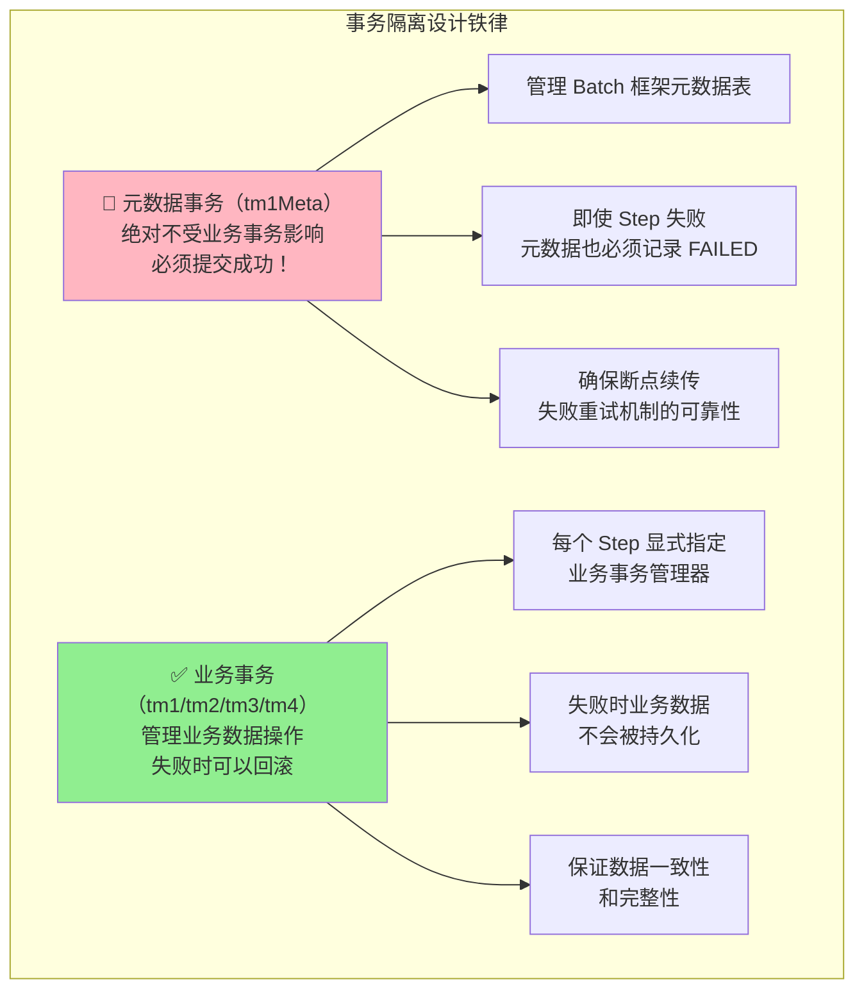
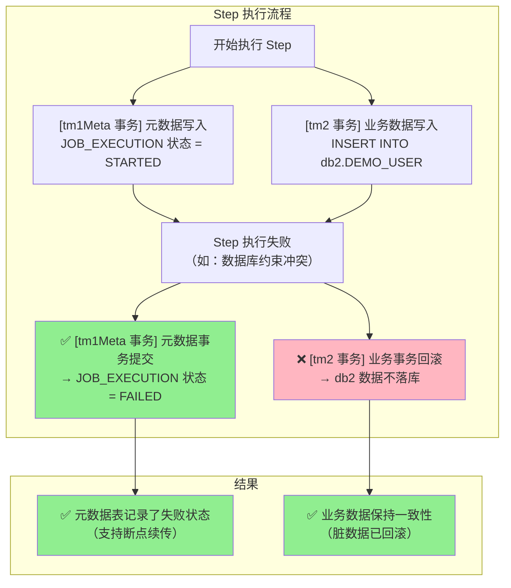

# 多数据源配置与事务隔离文档

## 文档信息

| 项目 | 内容 |
|------|------|
| **配置版本** | 1.0.0 |
| **文档日期** | 2026-01-20 |
| **适用场景** | 多数据库、分布式批处理 |

---

## 1. 多数据源架构概述

### 1.1 数据源规划

| 数据源 | 用途 | 数据库 | 事务管理器 |
|--------|------|--------|-----------|
| **db1** | Spring Batch 元数据 + 业务数据 | BatchWeaverDB | tm1Meta（元数据）/ tm1（业务） |
| **db2** | 业务数据库 2 | DB2_Business | tm2 |
| **db3** | 业务数据库 3 | DB3_Business | tm3 |
| **db4** | 业务数据库 4 | DB4_Business | tm4 |

### 1.2 事务隔离原则



### 1.3 失败场景流程



---

## 2. 数据源配置详解

### 2.1 application.yml 配置

```yaml
spring:
  datasource:
    # DB1: Spring Batch 元数据 + 业务数据（主数据源）
    db1:
      jdbc-url: jdbc:sqlserver://localhost:1433;databaseName=BatchWeaverDB;encrypt=true;trustServerCertificate=true
      username: sa
      password: YourPassword123
      driver-class-name: com.microsoft.sqlserver.jdbc.SQLServerDriver
      hikari:
        maximum-pool-size: 15
        minimum-idle: 5
        connection-timeout: 10000
        idle-timeout: 600000
        max-lifetime: 1800000
        pool-name: HikariPool-DB1

    # DB2: 业务数据库 2
    db2:
      jdbc-url: jdbc:sqlserver://localhost:1433;databaseName=DB2_Business;encrypt=true;trustServerCertificate=true
      username: sa
      password: YourPassword123
      driver-class-name: com.microsoft.sqlserver.jdbc.SQLServerDriver
      hikari:
        maximum-pool-size: 10
        minimum-idle: 3
        connection-timeout: 10000
        pool-name: HikariPool-DB2

    # DB3: 业务数据库 3
    db3:
      jdbc-url: jdbc:sqlserver://localhost:1433;databaseName=DB3_Business;encrypt=true;trustServerCertificate=true
      username: sa
      password: YourPassword123
      driver-class-name: com.microsoft.sqlserver.jdbc.SQLServerDriver
      hikari:
        maximum-pool-size: 10
        minimum-idle: 3
        connection-timeout: 10000
        pool-name: HikariPool-DB3

    # DB4: 业务数据库 4
    db4:
      jdbc-url: jdbc:sqlserver://localhost:1433;databaseName=DB4_Business;encrypt=true;trustServerCertificate=true
      username: sa
      password: YourPassword123
      driver-class-name: com.microsoft.sqlserver.jdbc.SQLServerDriver
      hikari:
        maximum-pool-size: 10
        minimum-idle: 3
        connection-timeout: 10000
        pool-name: HikariPool-DB4

  # Spring Batch 配置
  batch:
    jdbc:
      initialize-schema: always          # 自动初始化 Batch 元数据表
      table-prefix: BATCH_                # 元数据表前缀（默认）
    job:
      enabled: false                      # 禁止启动时自动运行 Job
```

### 2.2 DataSource1Config.java

**职责**：配置 db1 数据源、JdbcTemplate、事务管理器

```java
@Configuration
public class DataSource1Config {

    @Primary
    @Bean(name = "dataSource1")
    @ConfigurationProperties(prefix = "spring.datasource.db1")
    public DataSource dataSource1() {
        return DataSourceBuilder.create().build();
    }

    @Primary
    @Bean(name = "jdbcTemplate1")
    public JdbcTemplate jdbcTemplate1(@Qualifier("dataSource1") DataSource dataSource) {
        return new JdbcTemplate(dataSource);
    }

    @Primary
    @Bean(name = "namedJdbcTemplate1")
    public NamedParameterJdbcTemplate namedJdbcTemplate1(@Qualifier("dataSource1") DataSource dataSource) {
        return new NamedParameterJdbcTemplate(dataSource);
    }

    /**
     * tm1Meta - 元数据专用事务管理器（@Primary）
     * 用于 JobRepository 管理元数据表
     */
    @Primary
    @Bean(name = "tm1Meta")
    public PlatformTransactionManager tm1Meta(@Qualifier("dataSource1") DataSource dataSource) {
        return new DataSourceTransactionManager(dataSource);
    }

    /**
     * tm1 - db1 业务事务管理器
     * 用于 db1 业务表操作（必须显式指定）
     */
    @Bean(name = "tm1")
    public PlatformTransactionManager tm1(@Qualifier("dataSource1") DataSource dataSource) {
        return new DataSourceTransactionManager(dataSource);
    }
}
```

**关键点**：
- ✅ `@Primary` 注解标记为主数据源
- ✅ Bean 名称使用 `dataSource1`, `jdbcTemplate1`
- ✅ `tm1Meta`：元数据专用事务管理器，标记 `@Primary`，JobRepository 绑定此管理器
- ✅ `tm1`：db1 业务事务管理器，与 `tm2`/`tm3`/`tm4` 命名风格一致
- ✅ 职责分离：元数据与业务事务管理器分开，避免混淆

### 2.3 DataSource2Config.java

**职责**：配置 db2 数据源、JdbcTemplate、事务管理器

```java
@Configuration
public class DataSource2Config {

    @Bean(name = "dataSource2")
    @ConfigurationProperties(prefix = "spring.datasource.db2")
    public DataSource dataSource2() {
        return DataSourceBuilder.create().build();
    }

    @Bean(name = "jdbcTemplate2")
    public JdbcTemplate jdbcTemplate2(@Qualifier("dataSource2") DataSource dataSource) {
        return new JdbcTemplate(dataSource);
    }

    @Bean(name = "namedJdbcTemplate2")
    public NamedParameterJdbcTemplate namedJdbcTemplate2(@Qualifier("dataSource2") DataSource dataSource) {
        return new NamedParameterJdbcTemplate(dataSource);
    }

    @Bean(name = "tm2")
    public PlatformTransactionManager tm2(@Qualifier("dataSource2") DataSource dataSource) {
        return new DataSourceTransactionManager(dataSource);
    }
}
```

### 2.4 DataSource3/4Config.java

结构与 DataSource2Config 类似，修改 Bean 名称和配置前缀即可。

---

## 3. Batch 基础设施配置

### 3.1 BatchInfrastructureConfig.java

**职责**：配置 JobRepository、JobLauncher、JobExplorer

**关键配置**：JobRepository 必须绑定 tm1Meta（元数据专用事务管理器）

```java
@Configuration
@EnableBatchProcessing
public class BatchInfrastructureConfig {

    /**
     * 🔴 关键配置：JobRepository 绑定 tm1Meta（元数据专用事务管理器）
     * 确保元数据事务独立于业务事务，失败时元数据也能提交
     */
    @Bean
    public JobRepository jobRepository(
            @Qualifier("dataSource1") DataSource dataSource1,
            @Qualifier("tm1Meta") PlatformTransactionManager tm1Meta) throws Exception {

        JobRepositoryFactoryBean factory = new JobRepositoryFactoryBean();
        factory.setDataSource(dataSource1);       // ✅ 使用 db1 数据源
        factory.setTransactionManager(tm1Meta);   // 🔴 绑定 tm1Meta，确保元数据事务独立
        factory.setIsolationLevelForCreate("ISOLATION_READ_COMMITTED");
        factory.setTablePrefix("BATCH_");         // Spring Batch 元数据表前缀
        factory.afterPropertiesSet();
        return factory.getObject();
    }

    /**
     * JobLauncher 配置（使用上面的 JobRepository）
     */
    @Bean
    public JobLauncher jobLauncher(JobRepository jobRepository) throws Exception {
        TaskExecutorJobLauncher jobLauncher = new TaskExecutorJobLauncher();
        jobLauncher.setJobRepository(jobRepository);
        jobLauncher.afterPropertiesSet();
        return jobLauncher;
    }

    /**
     * JobExplorer 配置（用于查询批处理执行历史）
     */
    @Bean
    public JobExplorer jobExplorer(@Qualifier("dataSource1") DataSource dataSource1) throws Exception {
        JobExplorerFactoryBean factory = new JobExplorerFactoryBean();
        factory.setDataSource(dataSource1);
        factory.setTablePrefix("BATCH_");
        factory.afterPropertiesSet();
        return factory.getObject();
    }
}
```

**配置说明**：
- ✅ `JobRepository` 使用 `dataSource1`（db1）+ `tm1Meta`（元数据专用事务管理器）
- ✅ 所有元数据操作（BATCH_JOB_EXECUTION、BATCH_STEP_EXECUTION 等）由 tm1Meta 管理
- ✅ 即使 Step 业务逻辑失败（tm2 回滚），元数据也会提交（tm1Meta 独立提交）

---

## 4. Step 事务管理器配置

### 4.1 StepBuilder 显式绑定事务管理器

```java
@Configuration
public class DemoJobConfig {

    @Value("${batch.chunk-size:100}")
    private int chunkSize;

    @Bean
    public Step importFileStep(
            JobRepository jobRepository,
            @Qualifier("tm2") PlatformTransactionManager tm2,
            ItemReader<DemoUser> reader,
            ItemProcessor<DemoUser, DemoUser> processor,
            ItemWriter<DemoUser> writer) {

        return new StepBuilder("importFileStep", jobRepository)
                .<DemoUser, DemoUser>chunk(chunkSize, tm2)  // chunk() 的第二个参数就是事务管理器
                .reader(reader)
                .processor(processor)
                .writer(writer)
                .faultTolerant()
                .skipLimit(10)
                .skip(FlatFileParseException.class)
                .skip(BindException.class)
                .skip(IllegalArgumentException.class)
                .build();
    }

    @Bean
    public Job demoJob(JobRepository jobRepository, Step importFileStep) {
        return new JobBuilder("demoJob", jobRepository)
                .start(importFileStep)
                .build();
    }
}
```

**关键点**：
- ✅ `.chunk(chunkSize, tm2)` 的第二个参数指定业务事务管理器
- ✅ 每个 Step 必须显式指定业务事务管理器
- ✅ 业务事务与元数据事务完全隔离

### 4.2 Service 层事务注解

```java
@Service
public class Db2BusinessService {

    private final NamedParameterJdbcTemplate namedJdbcTemplate2;

    public Db2BusinessService(@Qualifier("namedJdbcTemplate2") NamedParameterJdbcTemplate namedJdbcTemplate2) {
        this.namedJdbcTemplate2 = namedJdbcTemplate2;
    }

    @Transactional(transactionManager = "tm2", propagation = Propagation.REQUIRED)
    public void batchInsertUsers(List<DemoUser> users) {
        String sql = "INSERT INTO DEMO_USER (id, name, email) VALUES (:id, :name, :email)";
        SqlParameterSource[] batchParams = users.stream()
            .map(user -> new MapSqlParameterSource()
                .addValue("id", user.getId())
                .addValue("name", user.getName())
                .addValue("email", user.getEmail()))
            .toArray(SqlParameterSource[]::new);
        namedJdbcTemplate2.batchUpdate(sql, batchParams);
    }
}
```

**关键点**：
- ✅ `@Transactional(transactionManager = "tm2")` 显式指定事务管理器
- ✅ 禁止使用 tm1Meta（元数据事务管理器）进行业务数据操作
- ✅ 每个数据源对应独立的事务管理器

---

## 5. 事务隔离验证

### 5.1 验证测试

**测试目标**：验证元数据事务独立性，确保业务失败时元数据仍能提交。

```java
@SpringBootTest
class TransactionIsolationTest {

    @Autowired
    private JobLauncher jobLauncher;

    @Autowired
    private Job demoJob;

    @Autowired
    @Qualifier("jdbcTemplate1")
    private JdbcTemplate jdbcTemplate1;  // 元数据库

    @Autowired
    @Qualifier("jdbcTemplate2")
    private JdbcTemplate jdbcTemplate2;  // 业务库

    @Test
    void testMetadataCommitWhenBusinessRollback() throws Exception {
        // 1. 清空业务表和元数据表
        jdbcTemplate2.execute("DELETE FROM DEMO_USER");
        jdbcTemplate1.execute("DELETE FROM BATCH_JOB_EXECUTION");
        jdbcTemplate1.execute("DELETE FROM BATCH_STEP_EXECUTION");

        // 2. 准备会触发异常的数据（如包含重复的主键）
        // ...

        // 3. 执行 Job（预期失败）
        JobExecution jobExecution = jobLauncher.run(demoJob, jobParameters);

        // 4. 验证：Job 执行状态为 FAILED
        assertEquals(BatchStatus.FAILED, jobExecution.getStatus());

        // 5. 验证：元数据表已记录 FAILED 状态（tm1Meta 提交成功）
        Long jobExecutionCount = jdbcTemplate1.queryForObject(
            "SELECT COUNT(*) FROM BATCH_JOB_EXECUTION WHERE STATUS = 'FAILED'",
            Long.class
        );
        assertEquals(1L, jobExecutionCount);

        // 6. ✅ 关键验证：业务表数据为空（tm2 回滚成功）
        Long businessDataCount = jdbcTemplate2.queryForObject(
            "SELECT COUNT(*) FROM DEMO_USER",
            Long.class
        );
        assertEquals(0L, businessDataCount, "业务事务应已回滚，业务表应为空！");
    }
}
```

### 5.2 验证标准

| 验证项 | 预期结果 | 说明 |
|--------|----------|------|
| Job 状态 | FAILED | Step 执行失败 |
| BATCH_JOB_EXECUTION | 有 FAILED 记录 | 元数据提交成功 |
| BATCH_STEP_EXECUTION | 有 FAILED 记录 | 元数据提交成功 |
| DEMO_USER | 0 条记录 | 业务数据回滚成功 |

**失败场景**：如果业务表有数据残留，说明事务隔离配置错误！

---

## 6. TransactionLogger - 事务日志观测工具

### 6.1 概述

**TransactionLogger** 是一个事务生命周期可视化工具，用于记录和观察多数据源环境中的事务行为。

**核心功能**：
- 记录事务开始/提交/回滚
- 显示传播行为、隔离级别
- SQL 执行跟踪
- 连接获取/释放日志

### 6.2 使用方式

#### 在 Tasklet 中使用

```java
@Bean
public Step step2SyncToDb3(
        JobRepository jobRepository,
        PlatformTransactionManager tm3,
        Db2BusinessService db2BusinessService,
        Db3BusinessService db3BusinessService) {

    return new StepBuilder("step2SyncToDb3", jobRepository)
            .tasklet((contribution, chunkContext) -> {
                // 记录事务开始
                TransactionLogger.TransactionContext txContext = TransactionLogger.logTransactionStart(
                        "step2SyncToDb3", new DefaultTransactionDefinition());
                TransactionLogger.registerTransactionSynchronization(txContext);

                // 业务逻辑
                List<DemoUser> users = db2BusinessService.getAllUsers();
                TransactionLogger.logSqlExecution("SELECT * FROM DEMO_USER (DB2)");

                db3BusinessService.batchInsertUsers(users);
                TransactionLogger.logSqlExecution("INSERT INTO DEMO_USER (DB3), count: " + users.size());

                return RepeatStatus.FINISHED;
            }, tm3)
            .build();
}
```

#### 日志输出示例

```
================================================================================
[事务开始] ID: 1, 名称: step2SyncToDb3, 线程: [1-main]
   传播行为: REQUIRED, 隔离级别: DEFAULT, 只读: false
   活跃事务数: true
================================================================================
   [SQL执行] SELECT * FROM DEMO_USER (DB2)
   [SQL执行] INSERT INTO DEMO_USER (DB3), count: 100
   [事务即将提交] ID: 1, 只读: false
   [事务已提交] ID: 1
================================================================================
[事务提交] ID: 1, 名称: step2SyncToDb3, 耗时: 45ms
================================================================================
```

### 6.3 API 说明

| 方法 | 说明 |
|------|------|
| `logTransactionStart()` | 记录事务开始，返回 TransactionContext |
| `logTransactionCommit()` | 记录事务提交 |
| `logTransactionRollback()` | 记录事务回滚 |
| `logSqlExecution()` | 记录 SQL 执行 |
| `logConnectionAcquisition()` | 记录连接获取 |
| `logConnectionRelease()` | 记录连接释放 |
| `registerTransactionSynchronization()` | 注册事务同步监听器 |

### 6.4 日志配置

在 `application.yml` 中配置日志级别：

```yaml
logging:
  level:
    # Spring 事务日志
    org.springframework.transaction: DEBUG
    org.springframework.transaction.interceptor: TRACE
    # JDBC 连接日志
    org.springframework.jdbc.datasource: DEBUG
    # JdbcTemplate 日志
    org.springframework.jdbc.core: DEBUG
    # 自定义事务日志器
    com.batchweaver.core.transaction: INFO
```

### 6.5 事务生命周期解读

```
[事务开始] → TransactionLogger.logTransactionStart()
   ↓
[SQL执行] → TransactionLogger.logSqlExecution()
   ↓
[事务即将提交] → beforeCommit() 回调
   ↓
[事务已提交] → afterCommit() 回调
   ↓
[事务提交] → 事务完成
```

### 6.6 使用建议

| 场景 | 是否需要 TransactionLogger | 原因 |
|------|---------------------------|------|
| Chunk 模式 | ❌ 不需要 | 事务边界清晰（每 N 条） |
| Tasklet（单步操作） | ❌ 不需要 | 逻辑简单，无需额外日志 |
| Tasklet（多步/跨库） | ✅ 推荐 | 需要观察复杂事务流程 |
| 调试事务问题 | ✅ 必需 | 快速定位问题 |

---

## 7. 常见问题与解决方案

### 7.1 事务管理器未指定

**问题**：Service 层未指定 transactionManager

```java
// ❌ 错误示例
@Transactional
public void batchInsertUsers(List<DemoUser> users) {
    // 使用默认事务管理器（tm1Meta，元数据事务管理器）
}
```

**解决方案**：

```java
// ✅ 正确示例
@Transactional(transactionManager = "tm2", propagation = Propagation.REQUIRED)
public void batchInsertUsers(List<DemoUser> users) {
    // 显式指定使用 tm2
}
```

### 7.2 Step 未绑定业务事务管理器

**问题**：Step 未指定 transactionManager

```java
// ❌ 错误示例
return new StepBuilder("importFileStep", jobRepository)
    .<DemoUser, DemoUser>chunk(100)  // 未指定事务管理器
    .reader(reader)
    .writer(writer)
    .build();
```

**解决方案**：

```java
// ✅ 正确示例
return new StepBuilder("importFileStep", jobRepository)
    .<DemoUser, DemoUser>chunk(100, tm2)  // 显式指定 tm2
    .reader(reader)
    .writer(writer)
    .build();
```

### 7.3 跨库事务问题

**问题**：单个 Step 中需要写入多个数据源

**解决方案**：

```java
// 方案1: 拆分为多个 Step，每个 Step 操作一个数据源
@Bean
public Job multiDatabaseJob(JobRepository jobRepository,
                            Step step1ToDb2,
                            Step step2ToDb3) {
    return new JobBuilder("multiDatabaseJob", jobRepository)
        .start(step1ToDb2)
        .next(step2ToDb3)
        .build();
}

// 方案2: 使用分布式事务（不推荐，增加复杂度）
// 如必须使用，考虑引入 Seata/Atomikos
```

### 7.4 连接池耗尽

**问题**：并发执行多个 Job 时连接池耗尽

**解决方案**：

```yaml
spring:
  datasource:
    db1:
      hikari:
        maximum-pool-size: 20      # 增加最大连接数
        minimum-idle: 10           # 增加最小空闲连接
        connection-timeout: 30000  # 增加连接超时
```

---

## 8. 最佳实践

### 8.1 命名规范

| 组件 | 命名规范 | 示例 |
|------|----------|------|
| DataSource | `dataSource{N}` | `dataSource1`, `dataSource2` |
| JdbcTemplate | `jdbcTemplate{N}` | `jdbcTemplate1`, `jdbcTemplate2` |
| TransactionManager | `tm{N}`, `tm{N}Meta` | `tm1`, `tm1Meta`, `tm2` |

**事务管理器命名说明**：
- `tm1Meta`：元数据专用事务管理器（db1），标记 `@Primary`，用于 JobRepository
- `tm1`：db1 业务事务管理器
- `tm2`~`tm4`：db2~db4 业务事务管理器
| Service | `{DbName}BusinessService` | `Db2BusinessService` |

### 8.2 配置检查清单

- [ ] `application.yml` 配置了所有数据源
- [ ] `DataSource1Config` 配置了 `tm1Meta` 和 `tm1`
- [ ] `BatchInfrastructureConfig` 的 JobRepository 绑定了 `tm1Meta`
- [ ] 每个 Step 显式指定了业务事务管理器
- [ ] Service 层 `@Transactional` 指定了 transactionManager
- [ ] 连接池配置合理（避免连接池耗尽）
- [ ] 事务隔离验证测试通过

### 8.3 性能优化

| 优化项 | 说明 | 推荐值 |
|--------|------|--------|
| 连接池大小 | 根据并发度调整 | 10-20 |
| Chunk 大小 | 平衡性能与内存 | 100-1000 |
| 连接超时 | 避免长时间等待 | 30秒 |
| 空闲超时 | 释放空闲连接 | 10分钟 |

---

## 9. 附录

### 9.1 元数据表说明

| 表名 | 说明 |
|------|------|
| BATCH_JOB_INSTANCE | Job 实例（参数不同则不同实例） |
| BATCH_JOB_EXECUTION | Job 执行记录（每次执行一条记录） |
| BATCH_JOB_EXECUTION_PARAMS | Job 执行参数 |
| BATCH_STEP_EXECUTION | Step 执行记录 |
| BATCH_STEP_EXECUTION_CONTEXT | Step 执行上下文 |

### 9.2 事务隔离级别

```java
// JobRepository 配置
factory.setIsolationLevelForCreate("ISOLATION_READ_COMMITTED");
```

| 隔离级别 | 说明 |
|----------|------|
| ISOLATION_READ_COMMITTED | 读取已提交数据（推荐） |
| ISOLATION_READ_UNCOMMITTED | 读取未提交数据（不推荐） |
| ISOLATION_REPEATABLE_READ | 可重复读 |
| ISOLATION_SERIALIZABLE | 串行化（性能差） |

---

**文档结束**
