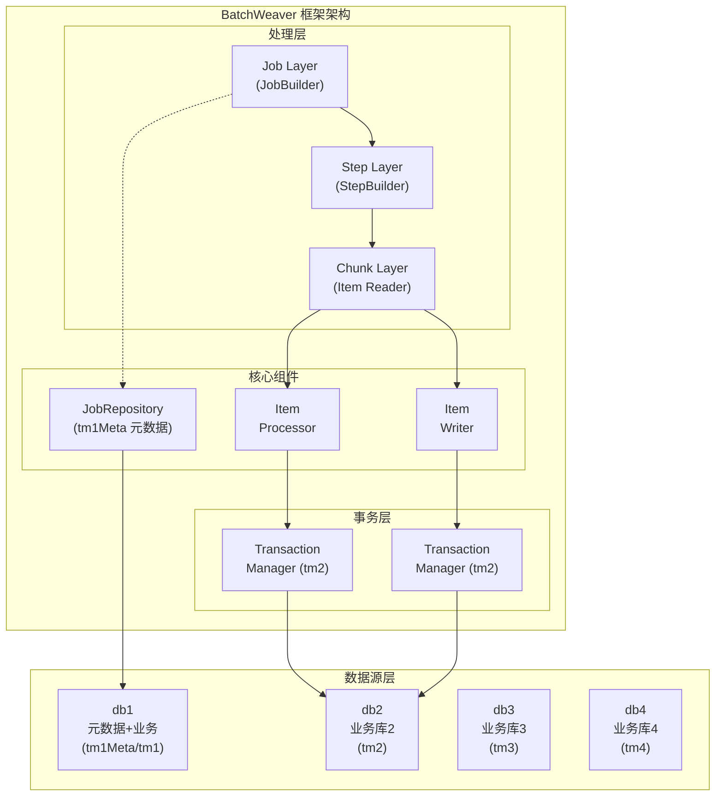
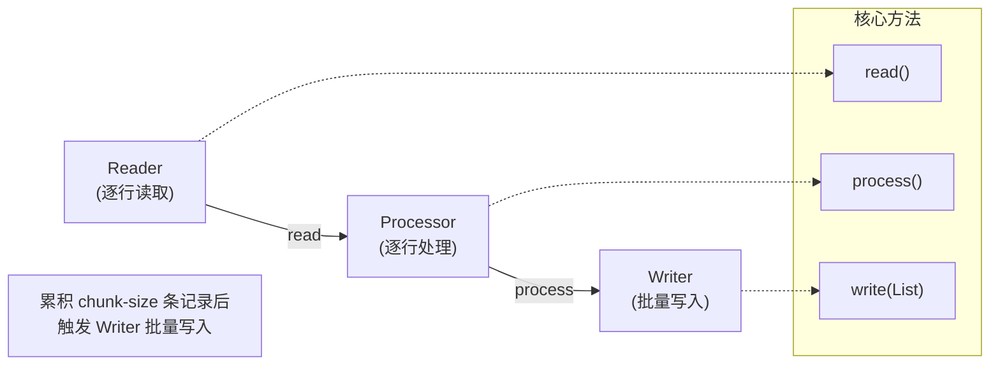
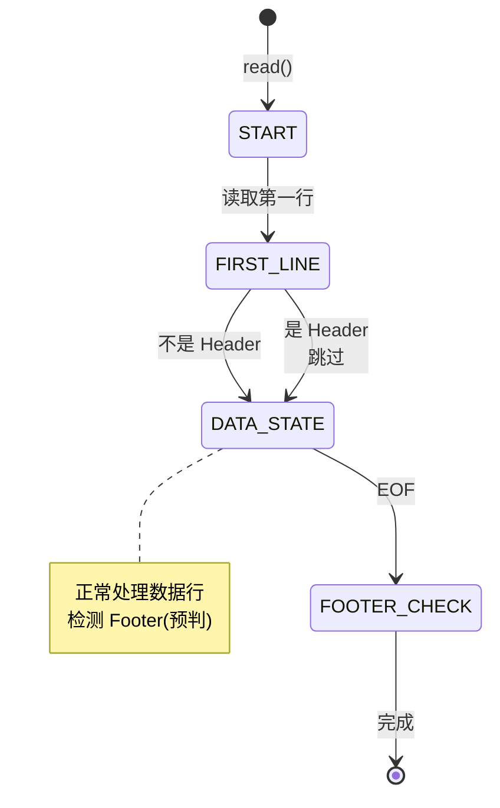

# BatchWeaver 技术框架文档

## 文档信息

| 项目 | 内容 |
|------|------|
| **框架版本** | 1.0.0 |
| **文档日期** | 2026-01-20 |
| **Spring Batch** | 5.x |
| **Spring Boot** | 3.5.7 |

---

## 1. 框架架构概述

### 1.1 整体架构图



### 1.2 核心设计原则

| 原则 | 描述 | 价值 |
|------|------|------|
| **事务隔离** | 元数据事务与业务事务严格分离 | 失败时元数据仍可记录，支持断点续传 |
| **单次扫描** | 文件只读取一次，O(1) 内存占用 | 零启动延迟，适合大文件处理 |
| **注解驱动** | 基于注解的字段映射与数据清洗 | 简化配置，提高开发效率 |
| **安全防护** | CSV 注入防护、路径安全校验 | 防止安全漏洞 |
| **模板化** | Job 构建模板封装重复逻辑 | 减少样板代码 |

---

## 2. 分层架构详解

### 2.1 Job 层

**职责**：定义批处理任务的整体流程

**核心类**：
- `JobBuilder` - Job 构建器
- `JobRepository` - Job 执行状态存储（绑定 tm1Meta）
- `JobLauncher` - Job 启动器
- `JobExplorer` - Job 执行历史查询

**示例**：

```java
@Bean
public Job importJob(JobRepository jobRepository, Step importStep) {
    return new JobBuilder("importJob", jobRepository)
        .start(importStep)
        .build();
}
```

### 2.2 Step 层

**职责**：定义单个处理步骤的读取-处理-写入流程

**核心类**：
- `StepBuilder` - Step 构建器
- `StepExecution` - Step 执行状态

**Chunk 配置**：

| 参数 | 说明 | 默认值 |
|------|------|--------|
| chunk-size | 每个 chunk 的记录数 | 100 |
| transaction-manager | 事务管理器 | tm2/tm3/tm4 |

**示例**：

```java
@Bean
public Step importStep(JobRepository jobRepository,
                       @Qualifier("tm2") PlatformTransactionManager tm2,
                       ItemReader<DemoUser> reader,
                       ItemProcessor<DemoUser, DemoUser> processor,
                       ItemWriter<DemoUser> writer) {
    return new StepBuilder("importStep", jobRepository)
        .<DemoUser, DemoUser>chunk(100, tm2)  // chunk 模式
        .reader(reader)
        .processor(processor)
        .writer(writer)
        .faultTolerant()
        .skipLimit(10)
        .skip(Exception.class)
        .build();
}
```

### 2.3 Chunk 层

**职责**：具体的读取-处理-写入逻辑

**组件**：

| 组件 | 接口 | 说明 |
|------|------|------|
| **Reader** | `ItemReader<T>` | 数据读取 |
| **Processor** | `ItemProcessor<I, O>` | 数据转换与校验 |
| **Writer** | `ItemWriter<T>` | 数据写入 |

**执行流程**：



**流程说明**：
1. Reader 逐行读取数据
2. Processor 逐行处理转换
3. 累积到 chunk-size 条记录后，Writer 批量写入

---

## 3. 核心组件详解

### 3.1 文件处理组件

#### HeaderFooterAwareReader

**架构创新**：单次扫描 + 延迟决策模式

```
传统方案（预扫描）:
├── open() → 预扫描整个文件 → 识别 Header/Footer
├── read() → 正式读取数据
└── 问题: 启动延迟高，内存占用大

本方案（延迟决策）:
├── open() → 仅初始化，不扫描
├── read() → 单次顺序扫描 + 延迟判断
│   ├── 第一行 → 延迟判断是否为 Header
│   ├── 中间行 → 作为数据处理
│   └── 最后一行 → 延迟判断是否为 Footer
└── 优势: 零启动延迟，O(1) 内存
```

**状态机**：



**状态说明**：
| 状态 | 说明 |
|------|------|
| `START` | 初始状态，等待读取 |
| `FIRST_LINE` | 第一行 - 延迟判断是否为 Header |
| `DATA_STATE` | 数据行 - 正常处理，同时检测 Footer |
| `FOOTER_CHECK` | 文件结束 - 校验 Footer |

**关键代码**：

```java
private T read() throws Exception {
    if (currentLine == null) {
        currentLine = bufferedReader.readLine();
        if (currentLine == null) {
            // EOF - 延迟判断最后一行
            return handleEndOfFile();
        }
    }

    if (state == ReaderState.START) {
        // 第一行 - 延迟判断是否为 Header
        if (isHeaderLine(currentLine)) {
            headerInfo = headerParser.parse(currentLine);
            if (headerValidator != null) {
                headerValidator.validate(headerInfo);
            }
            advanceLine();
            return read(); // 递归读取第一行数据
        }
        state = ReaderState.DATA;
    }

    if (state == ReaderState.DATA) {
        // 检查是否为 Footer（提前预判）
        if (isFooterLine(currentLine)) {
            footerInfo = footerParser.parse(currentLine);
            return null;
        }
        // 正常数据处理
        String lineToProcess = currentLine;
        advanceLine();
        actualRecordCount++;
        return processLine(lineToProcess);
    }

    return null;
}
```

#### AnnotationDrivenFieldSetMapper

**功能**：解析 `@FileColumn` 注解，自动完成字段映射

**支持的数据清洗**：

| 选项 | 说明 | 示例 |
|------|------|------|
| trim | 去除前后空格 | `"  abc  "` → `"abc"` |
| toUpperCase | 转大写 | `"abc"` → `"ABC"` |
| toLowerCase | 转小写 | `"ABC"` → `"abc"` |
| defaultValue | 默认值 | `""` → `"unknown@example.com"` |
| converter | 自定义转换器 | `StringToDateConverter` |

**实体类示例**：

```java
@Data
public class DemoUser {
    @FileColumn(index = 0, name = "userId")
    private Integer id;

    @FileColumn(index = 1, trim = true, toUpperCase = true)
    private String name;

    @FileColumn(index = 2, trim = true, defaultValue = "unknown@example.com")
    private String email;

    @FileColumn(index = 3, pattern = "yyyy-MM-dd")
    private Date birthDate;
}
```

### 3.2 函数式接口组件

#### 核心接口

| 接口 | 用途 | 方法 |
|------|------|------|
| `HeaderParser` | 解析 Header 行 | `HeaderInfo parse(String line)` |
| `HeaderValidator` | 校验 Header | `void validate(HeaderInfo header)` |
| `FooterParser` | 解析 Footer 行 | `FooterInfo parse(String line)` |
| `FooterValidator` | 校验 Footer | `void validate(FooterInfo footer, long actual)` |
| `FooterLineDetector` | 检测 Footer 行 | `boolean isFooterLine(String line)` |

#### 使用示例

```java
// Header 解析
HeaderParser headerParser = line -> {
    LocalDate date = LocalDate.parse(line, DateTimeFormatter.ofPattern("yyyyMMdd"));
    return new HeaderInfo(date);
};

// Header 校验
HeaderValidator headerValidator = header -> {
    if (!header.getDate().equals(LocalDate.now())) {
        throw new IllegalStateException("Date mismatch");
    }
};

// Footer 解析
FooterParser footerParser = line -> {
    long count = Long.parseLong(line.trim());
    return new FooterInfo(count);
};

// Footer 校验
FooterValidator footerValidator = (footer, actual) -> {
    if (footer.getCount() != actual) {
        throw new IllegalStateException("Count mismatch");
    }
};
```

### 3.3 Job 构建模板

#### FileImportJobTemplate

**功能**：简化文件导入 Job 的配置

**支持的配置项**：

| 配置 | 说明 | 默认值 |
|------|------|--------|
| jobName | Job 名称 | - |
| stepName | Step 名称 | - |
| jobRepository | Job 仓库 | - |
| transactionManager | 事务管理器 | - |
| reader | Reader | - |
| processor | Processor | null |
| writer | Writer | - |
| headerParser | Header 解析器 | null |
| headerValidator | Header 校验器 | null |
| footerParser | Footer 解析器 | null |
| footerValidator | Footer 校验器 | null |
| chunkSize | Chunk 大小 | 1000 |
| skipLimit | Skip 限制 | 100 |
| retryLimit | Retry 限制 | 3 |

**使用示例**：

```java
FileImportJobTemplate.FileImportJobDefinition<DemoUser, DemoUser> definition =
    FileImportJobTemplate.FileImportJobDefinition.<DemoUser, DemoUser>builder()
        .jobName("importJob")
        .stepName("importStep")
        .jobRepository(jobRepository)
        .transactionManager(tm2)
        .reader(reader)
        .processor(processor)
        .writer(writer)
        .headerParser(headerParser)
        .headerValidator(headerValidator)
        .footerParser(footerParser)
        .footerValidator(footerValidator)
        .chunkSize(1000)
        .skipLimit(100)
        .retryLimit(3)
        .build();

Job job = template.buildJob(definition);
```

#### FileExportJobTemplate

**功能**：简化文件导出 Job 的配置

**支持的配置项**：

| 配置 | 说明 | 默认值 |
|------|------|--------|
| jobName | Job 名称 | - |
| stepName | Step 名称 | - |
| jobRepository | Job 仓库 | - |
| transactionManager | 事务管理器 | - |
| reader | Reader | - |
| resource | 输出文件 | - |
| entityClass | 实体类 | - |
| delimiter | 分隔符 | `,` |
| headerGenerator | Header 生成器 | null |
| footerGenerator | Footer 生成器 | null |
| chunkSize | Chunk 大小 | 1000 |

**使用示例**：

```java
FileExportJobTemplate.FileExportJobDefinition<DemoUser> definition =
    FileExportJobTemplate.FileExportJobDefinition.<DemoUser>builder()
        .jobName("exportJob")
        .stepName("exportStep")
        .jobRepository(jobRepository)
        .transactionManager(tm2)
        .reader(reader)
        .resource(new FileSystemResource("data/output/export.txt"))
        .entityClass(DemoUser.class)
        .delimiter(",")
        .headerGenerator(date -> date.format(DateTimeFormatter.ofPattern("yyyyMMdd")))
        .footerGenerator(String::valueOf)
        .build();

Job job = template.buildJob(definition);
```

### 3.4 安全组件

#### CsvInjectionSanitizer

**功能**：防止 CSV 注入攻击

**危险字符**：`=`, `+`, `-`, `@` 开头的内容

**防护策略**：在危险字符前添加单引号

```java
public String sanitize(String value) {
    if (value == null) return null;

    if (DANGEROUS_PREFIX.matcher(value).find()) {
        return "'" + value;  // 转义
    }

    return value;
}
```

#### FilePathNormalizer

**功能**：防止路径遍历攻击

**防护策略**：
- 禁止 `..` 路径遍历
- 禁止绝对路径（可选）
- 规范化路径

```java
public String normalize(String filePath) throws SecurityException {
    // 防止路径遍历攻击
    if (PATH_TRAVERSAL.matcher(filePath).find()) {
        throw new SecurityException("Path traversal detected: " + filePath);
    }

    // 禁止绝对路径
    Path path = Paths.get(filePath);
    if (path.isAbsolute()) {
        throw new SecurityException("Absolute path not allowed: " + filePath);
    }

    // 规范化路径
    return path.normalize().toString();
}
```

---

## 4. 设计模式应用

### 4.1 Builder 模式

**应用场景**：Job 构建模板

**优势**：
- 链式调用
- 参数可选
- 代码清晰

```java
FileImportJobDefinition.builder()
    .jobName("importJob")
    .chunkSize(1000)
    .skipLimit(100)
    .build();
```

### 4.2 Template Method 模式

**应用场景**：FileImportJobTemplate

**优势**：
- 定义算法骨架
- 子步骤可定制
- 减少重复代码

```java
public <I, O> Job buildJob(FileImportJobDefinition<I, O> definition) {
    // 1. 构建 Step（模板方法）
    Step step = buildStep(definition);

    // 2. 构建 Job
    return new JobBuilder(definition.getJobName(), definition.getJobRepository())
        .start(step)
        .build();
}
```

### 4.3 Strategy 模式

**应用场景**：HeaderParser, FooterParser

**优势**：
- 算法可替换
- 符合开闭原则
- 易于扩展

```java
// 策略1: yyyyMMdd 格式
HeaderParser parser1 = line -> new HeaderInfo(
    LocalDate.parse(line, DateTimeFormatter.ofPattern("yyyyMMdd"))
);

// 策略2: MMddyyyy 格式
HeaderParser parser2 = line -> new HeaderInfo(
    LocalDate.parse(line, DateTimeFormatter.ofPattern("MMddyyyy"))
);
```

### 4.4 Function Interface 模式

**应用场景**：函数式接口定义

**优势**：
- Lambda 表达式支持
- 代码简洁
- 类型安全

```java
@FunctionalInterface
public interface HeaderParser {
    HeaderInfo parse(String line);
}

// 使用 Lambda
HeaderParser parser = line -> new HeaderInfo(LocalDate.parse(line));
```

---

## 5. 类型转换器体系

### 5.1 内置转换器

| 转换器 | 源类型 | 目标类型 | 格式 |
|--------|--------|----------|------|
| StringToIntegerConverter | String | Integer | - |
| StringToLongConverter | String | Long | - |
| StringToBigDecimalConverter | String | BigDecimal | - |
| StringToDateConverter | String | Date | yyyyMMdd |
| StringToLocalDateConverter | String | LocalDate | yyyy-MM-dd |

### 5.2 自定义转换器

**实现方式**：

```java
public class CustomDateConverter implements TypeConverter {

    private final DateTimeFormatter formatter;

    public CustomDateConverter(String pattern) {
        this.formatter = DateTimeFormatter.ofPattern(pattern);
    }

    @Override
    public Object convert(String value) {
        if (value == null || value.isEmpty()) {
            return null;
        }
        return LocalDate.parse(value, formatter);
    }
}

// 使用
@FileColumn(index = 0, converter = CustomDateConverter.class)
private LocalDate birthDate;
```

---

## 6. 扩展点指南

### 6.1 自定义 Reader

**场景**：读取特殊格式文件

**步骤**：
1. 实现 `ItemReader<T>` 接口
2. 实现 `read()` 方法
3. 处理资源打开与关闭

```java
public class CustomReader<T> implements ItemReader<T> {

    private final Resource resource;
    private BufferedReader reader;

    @Override
    public T read() throws Exception {
        String line = reader.readLine();
        if (line == null) {
            return null;
        }
        return parseLine(line);
    }

    @Override
    public void open(ExecutionContext executionContext) {
        reader = new BufferedReader(new InputStreamReader(resource.getInputStream()));
    }

    @Override
    public void close() {
        if (reader != null) {
            reader.close();
        }
    }
}
```

### 6.2 自定义 Processor

**场景**：数据转换、校验、清洗

**步骤**：
1. 实现 `ItemProcessor<I, O>` 接口
2. 实现 `process()` 方法
3. 返回 null 表示过滤该记录

```java
public class CustomProcessor implements ItemProcessor<DemoUser, DemoUser> {

    @Override
    public DemoUser process(DemoUser user) throws Exception {
        // 数据校验
        if (user.getEmail() == null || user.getEmail().isEmpty()) {
            return null;  // 过滤无效记录
        }

        // 数据转换
        user.setName(user.getName().toUpperCase());

        return user;
    }
}
```

### 6.3 自定义 Writer

**场景**：写入特殊目标（如 API、消息队列）

**步骤**：
1. 实现 `ItemWriter<T>` 接口
2. 实现 `write()` 方法
3. 处理批量写入逻辑

```java
public class ApiWriter<T> implements ItemWriter<T> {

    private final RestTemplate restTemplate;
    private final String apiUrl;

    @Override
    public void write(List<? extends T> items) throws Exception {
        for (T item : items) {
            restTemplate.postForEntity(apiUrl, item, Void.class);
        }
    }
}
```

---

## 7. 性能优化建议

### 7.1 Chunk 大小选择

| 数据量 | 推荐 Chunk 大小 | 说明 |
|--------|----------------|------|
| 小数据量 (< 1,000) | 50-100 | 减少事务次数 |
| 中数据量 (1,000-100,000) | 500-1,000 | 平衡性能与内存 |
| 大数据量 (> 100,000) | 1,000-5,000 | 提高吞吐量 |

### 7.2 连接池配置

```yaml
spring:
  datasource:
    db1:
      hikari:
        maximum-pool-size: 15      # 最大连接数
        minimum-idle: 5            # 最小空闲连接
        connection-timeout: 30000  # 连接超时
        idle-timeout: 600000       # 空闲超时
        max-lifetime: 1800000      # 连接最大生命周期
```

### 7.3 JVM 参数建议

```bash
# 大文件处理场景
java -Xms2g -Xmx4g \
     -XX:+UseG1GC \
     -XX:MaxGCPauseMillis=200 \
     -jar batch-weaver.jar
```

---

## 8. 故障排查指南

### 8.1 常见问题

| 问题 | 可能原因 | 解决方案 |
|------|----------|----------|
| Job 未启动 | `spring.batch.job.enabled=false` | 使用 JobLauncher 手动触发 |
| 事务回滚 | 数据库连接问题 | 检查数据源配置 |
| 内存溢出 | Chunk 过大 | 减小 chunk-size |
| 文件找不到 | 路径错误 | 检查文件路径 |

### 8.2 日志配置

```yaml
logging:
  level:
    org.springframework.batch: DEBUG
    com.batchweaver: DEBUG
    org.springframework.jdbc: DEBUG
```

---

**文档结束**
