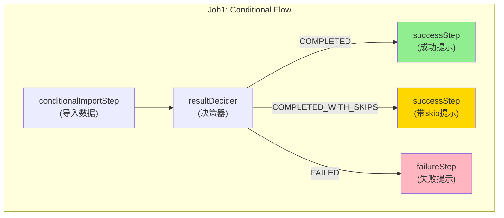
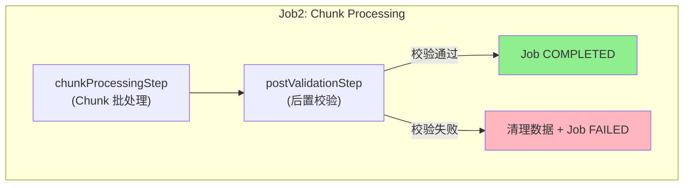
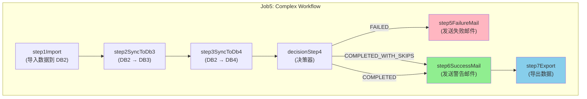

# BatchWeaver 测试文档

## 文档信息

| 项目 | 内容 |
|------|------|
| **文档版本** | 1.1.0 |
| **创建日期** | 2026-01-20 |
| **更新日期** | 2026-01-20 |
| **适用框架** | BatchWeaver (基于 Spring Batch 5.x) |
| **测试环境** | Java 21 + Spring Boot 3.5.7 + SQL Server 2022 |

---

## 1. 测试环境配置

### 1.1 环境要求

| 组件 | 版本要求 |
|------|----------|
| JDK | 21+ |
| Maven | 3.8+ |
| SQL Server | 2022 |
| Spring Boot | 3.5.7 |

### 1.2 数据库配置

#### 创建数据库

```sql
CREATE DATABASE BatchWeaverDB;
CREATE DATABASE DB2_Business;
CREATE DATABASE DB3_Business;
CREATE DATABASE DB4_Business;
```

#### 配置文件位置

```
src/main/resources/application.yml
```

#### 关键配置项

```yaml
spring:
  datasource:
    db1:
      jdbc-url: jdbc:sqlserver://localhost:1433;databaseName=BatchWeaverDB;encrypt=true;trustServerCertificate=true
      username: sa
      password: YourPassword123
    db2:
      jdbc-url: jdbc:sqlserver://localhost:1433;databaseName=DB2_Business;encrypt=true;trustServerCertificate=true
      username: sa
      password: YourPassword123
  batch:
    job:
      enabled: false  # 禁止自动启动，通过 JobLauncher 手动触发
```

### 1.3 创建测试表

```sql
-- DB2: 用户表
USE DB2_Business;
CREATE TABLE DEMO_USER (
    id INT PRIMARY KEY,
    name NVARCHAR(100),
    email NVARCHAR(200),
    birth_date DATE
);

-- DB3/DB4: 类似结构
USE DB3_Business;
CREATE TABLE DEMO_USER (
    id INT PRIMARY KEY,
    name NVARCHAR(100),
    email NVARCHAR(200),
    birth_date DATE
);
```

### 1.4 测试代码结构

```
src/
├── main/java/com/batchweaver/demo/config/
│   ├── ConditionalFlowConfig.java    # Job1 配置
│   ├── ChunkProcessingConfig.java    # Job2 配置
│   ├── FileImportConfig.java         # Job3 配置
│   ├── FileExportConfig.java         # Job4 配置
│   └── ComplexWorkflowConfig.java    # Job5 配置
└── test/java/com/batchweaver/demo/
    ├── AbstractBatchTest.java        # 测试基类
    ├── Job1ConditionalFlowTest.java  # Job1 测试
    ├── Job2ChunkProcessingTest.java  # Job2 测试
    ├── Job3FileImportTest.java       # Job3 测试
    ├── Job4FileExportTest.java       # Job4 测试
    ├── Job5ComplexWorkflowTest.java  # Job5 测试
    └── TransactionIsolationTest.java # 事务隔离测试
```

---

## 2. 测试数据准备

### 2.1 测试文件目录结构

```
data/
├── input/
│   ├── demo_users.txt           # 基础测试文件 (Job1)
│   ├── workflow_users.txt       # 工作流测试文件 (Job5)
│   ├── large_users.txt          # 大批量测试文件 (Job2)
│   ├── format1_users.txt        # 格式1: yyyyMMdd + 纯数字
│   ├── format2_users.txt        # 格式2:MMddyyyy + R前缀
│   ├── format3_users.txt        # 格式3: 无头尾
│   └── invalid_users.txt        # 异常测试文件
└── output/
    ├── format1_export.txt       # 格式1导出
    ├── format2_export.txt       # 格式2导出
    └── result_export.txt        # 结果导出 (Job5)
```

### 2.2 测试文件内容

#### demo_users.txt (Job1 基础文件)

```
H|20260120|USER_IMPORT
1|张三|25|zhangsan@example.com|1990-01-15
2|李四|30|lisi@example.com|1985-06-20
3|王五|28|wangwu@example.com|1987-03-10
T|3
```

#### workflow_users.txt (Job5 工作流文件)

```
20260120
张三,25,zhangsan@example.com,1990-01-15
李四,30,lisi@example.com,1985-06-20
王五,28,wangwu@example.com,1987-03-10
3
```

#### format1_users.txt (格式1: yyyyMMdd + 纯数字)

```
20260120
张三,25,zhangsan@example.com,1990-01-15
李四,30,lisi@example.com,1985-06-20
王五,28,wangwu@example.com,1987-03-10
3
```

#### format2_users.txt (格式2: MMddyyyy + R前缀)

```
01202026
张三,25,zhangsan@example.com,1990-01-15
李四,30,lisi@example.com,1985-06-20
王五,28,wangwu@example.com,1987-03-10
R00003
```

#### format3_users.txt (格式3: 无头尾)

```
张三,25,zhangsan@example.com,1990-01-15
李四,30,lisi@example.com,1985-06-20
王五,28,wangwu@example.com,1987-03-10
```

#### invalid_users.txt (异常测试)

```
20260119
张三,25,zhangsan@example.com,1990-01-15
李四,INVALID_EMAIL,lisi@example.com,1985-06-20
王五,28,wangwu@example.com,1987-03-10
3
```

---

## 3. Job 测试用例

### Job1: 条件流程测试 (Conditional Flow)

#### 测试目的
验证 Spring Batch 的条件分支功能，根据数据处理结果执行不同流程。

#### 配置信息

| 项目 | 值 |
|------|-----|
| **配置类** | `com.batchweaver.demo.config.ConditionalFlowConfig` |
| **Job名称** | `conditionalFlowJob` |
| **测试类** | `com.batchweaver.demo.Job1ConditionalFlowTest` |
| **文件格式** | `H\|yyyyMMdd\|type` + 数据 + `T\|count` |

#### 工作流图



#### 测试场景

| 场景 | 描述 | 预期结果 |
|------|------|----------|
| **正向** | 正常执行导入 | ✅ Step执行完成，状态COMPLETED<br>✅ DB2插入3条记录<br>✅ 进入successStep |
| **带Skip** | 数据包含错误行（启用skip） | ✅ 跳过错误行，完成其他记录<br>⚠️ 进入successStep，日志记录skip次数 |
| **失败** | 数据格式严重错误 | ❌ 进入failureStep |

#### 测试步骤

1. **准备阶段**
   ```sql
   -- 清空DB2业务表
   DELETE FROM DB2_Business.dbo.DEMO_USER;
   ```

2. **执行Job**
   ```bash
   # 使用 JUnit 测试
   mvn test -Dtest=Job1ConditionalFlowTest
   ```

3. **验证结果**
   ```sql
   -- 验证数据导入
   SELECT COUNT(*) FROM DB2_Business.dbo.DEMO_USER;
   -- 预期结果: 3

   -- 验证元数据
   SELECT JOB_NAME, STATUS, EXIT_CODE
   FROM BatchWeaverDB.dbo.BATCH_JOB_EXECUTION
   WHERE JOB_NAME = 'conditionalFlowJob';
   -- 预期结果: STATUS=COMPLETED, EXIT_CODE=COMPLETED
   ```

#### 预期输出值

| 指标 | 预期值 |
|------|--------|
| 读取记录数 | 3 |
| 写入记录数 | 3 |
| 跳过记录数 | 0 |
| Job状态 | COMPLETED |
| 执行时间 | < 5秒 |

---

### Job2: 批处理模式测试 (Chunk-Oriented Processing)

#### 测试目的
验证基于 Chunk 的批处理模式，测试 commit-interval 和事务边界，以及 Footer 校验失败时的数据回滚机制。

#### 配置信息

| 项目 | 值 |
|------|-----|
| **配置类** | `com.batchweaver.demo.config.ChunkProcessingConfig` |
| **Job名称** | `chunkProcessingJob` |
| **测试类** | `com.batchweaver.demo.Job2ChunkProcessingTest` |
| **文件格式** | `yyyyMMdd` + 数据行 + `count` |

#### Job 工作流



**步骤说明**：

1. **chunkProcessingStep**:
   - 以 Chunk 模式读取文件并写入数据库
   - 每 10 条记录提交一次事务
   - Footer 信息存储到 JobExecutionContext，但不校验

2. **postValidationStep**:
   - 从 JobExecutionContext 获取 Footer 声明的记录数
   - 查询数据库实际记录数
   - 如果不匹配，执行 `DELETE FROM DEMO_USER` 清理数据并失败
   - 如果匹配，Job 成功完成

**设计原理**：

由于 Spring Batch 的 Chunk 处理模式中每个 chunk 是独立事务，如果在 Reader 阶段进行 Footer 校验，失败时前面的 chunks 已经提交无法回滚。因此采用后置校验机制，在所有数据处理完成后进行校验，如果失败则手动清理数据。

#### Chunk配置

```yaml
batch:
  chunk-size: 10  # 每10条记录提交一次
```

#### 测试场景

##### 场景1: 正常处理（Footer 匹配）

| 场景 | 数据量 | Chunk大小 | 预期提交次数 |
|------|--------|-----------|--------------|
| **小批量** | 100条 | 10 | 10次 |
| **中批量** | 1,000条 | 10 | 100次 |
| **大批量** | 10,000条 | 100 | 100次 |

**预期结果**：
- ✅ chunkProcessingStep: COMPLETED
- ✅ postValidationStep: COMPLETED
- ✅ Job状态: COMPLETED
- ✅ 数据库记录数 = Footer 声明数

##### 场景2: Footer 校验失败（数量不匹配）

**前置条件**：
```
data/input/large_users.txt
- Header: 20260122
- 数据行: 100条
- Footer: 101 (故意错误)
```

**预期结果**：
- ✅ chunkProcessingStep: COMPLETED (Read: 100, Written: 100)
- ❌ postValidationStep: FAILED
- ❌ Job状态: FAILED
- ✅ 数据库记录数: 0 (已回滚)
- ✅ 错误信息: "Post-validation failed: Footer declared 101 records, but database contains 100 records. Data has been rolled back."

**日志输出**：
```
[CHUNK] Step completed. Read: 100, Written: 100, Skipped: 0
[POST-VALIDATION] Declared count: 101, Actual DB count: 100
[POST-VALIDATION] Count mismatch! Rolling back data...
[POST-VALIDATION] Data rolled back successfully
```

#### 测试步骤

1. **准备测试文件**
   ```bash
   # 生成100条测试数据
   python scripts/generate_test_data.py --count 100 --output data/input/large_users.txt
   ```

2. **执行Job并监控**
   ```bash
   mvn spring-boot:run -Dspring-boot.run.arguments="--job.name=chunkProcessingJob"
   ```

3. **验证事务提交**
   ```sql
   -- 检查最终结果
   SELECT COUNT(*) FROM DB2_Business.dbo.DEMO_USER;
   -- 正常情况: 100
   -- Footer 错误情况: 0 (已回滚)
   ```

#### 预期输出值

| 数据量 | Chunk大小 | 预期耗时 | 内存占用 |
|--------|-----------|----------|----------|
| 100 | 10 | < 5秒 | < 50MB |
| 1,000 | 10 | < 10秒 | < 50MB |
| 10,000 | 100 | < 30秒 | < 100MB |

---

### Job3: 文件导入测试 (File Import)

#### 测试目的
验证不同格式的文件导入功能，包括 Header/Footer 校验。

#### 配置信息

| 项目 | 值 |
|------|-----|
| **配置类** | `com.batchweaver.demo.config.FileImportConfig` |
| **测试类** | `com.batchweaver.demo.Job3FileImportTest` |

#### Job列表

| Job名称 | 文件格式 | Header | Footer |
|---------|----------|--------|--------|
| format1ImportJob | yyyyMMdd + 纯数字 | `20260120` | `3` |
| format2ImportJob | MMddyyyy + R前缀 | `01202026` | `R00003` |
| format3ImportJob | 无头尾 | 无 | 无 |

#### 测试场景

##### 场景1: 格式1正常导入

**前置条件**
```
data/input/format1_users.txt 存在且内容正确
```

**预期结果**
- ✅ Job状态: COMPLETED
- ✅ 读取记录数: 3
- ✅ Header校验通过
- ✅ Footer校验通过 (count=3)
- ✅ DB2插入3条记录

**预期输出值**
```
Header parsed: 2026-01-20
Footer validation passed: expected=3, actual=3
```

##### 场景2: 格式2正常导入

**前置条件**
```
data/input/format2_users.txt 存在且内容正确
```

**预期结果**
- ✅ Job状态: COMPLETED
- ✅ 读取记录数: 3
- ✅ Header解析: MMddyyyy格式
- ✅ Footer解析: R前缀识别

##### 场景3: 无头尾导入

**前置条件**
```
data/input/format3_users.txt 存在且无头尾
```

**预期结果**
- ✅ Job状态: COMPLETED
- ✅ 读取记录数: 3
- ✅ 无Header/Footer校验

##### 场景4: Header日期不匹配（负向）

**前置条件**
```
data/input/format1_users.txt Header日期为 20260119（非今天）
```

**预期结果**
- ⚠️ Job状态: COMPLETED (当前实现仅打印警告)
- ⚠️ 日志: "Header date mismatch"

##### 场景5: Footer数量不匹配（负向）

**前置条件**
```
data/input/format1_users.txt Footer count=5（实际只有3条数据）
```

**预期结果**
- ❌ Job状态: FAILED
- ❌ 异常: IllegalStateException("Count mismatch")

**预期输出值**
```
ERROR FooterValidator: Count mismatch - expected: 5, actual: 3
```

---

### Job4: 文件导出测试 (File Export)

#### 测试目的
验证数据从数据库导出到文件的功能，包括 Header/Footer 生成。

#### 配置信息

| 项目 | 值 |
|------|-----|
| **配置类** | `com.batchweaver.demo.config.FileExportConfig` |
| **测试类** | `com.batchweaver.demo.Job4FileExportTest` |

#### Job列表

| Job名称 | 输出文件 | Header格式 | Footer格式 |
|---------|----------|------------|------------|
| format1ExportJob | format1_export.txt | yyyyMMdd | 纯数字 |
| format2ExportJob | format2_export.txt | MMddyyyy | R前缀 |

#### 测试场景

##### 场景1: 格式1导出

**前置条件**
```sql
-- DB2包含测试数据
INSERT INTO DB2_Business.dbo.DEMO_USER VALUES
(1, N'张三', 'zhangsan@example.com', '1990-01-15'),
(2, N'李四', 'lisi@example.com', '1985-06-20'),
(3, N'王五', 'wangwu@example.com', '1987-03-10');
```

**预期结果**
- ✅ Job状态: COMPLETED
- ✅ 生成文件: data/output/format1_export.txt
- ✅ 文件内容格式正确

**预期文件内容**
```
20260120
张三,25,zhangsan@example.com,1990-01-15
李四,30,lisi@example.com,1985-06-20
王五,28,wangwu@example.com,1987-03-10
3
```

##### 场景2: 格式2导出

**预期文件内容**
```
01202026
张三,25,zhangsan@example.com,1990-01-15
李四,30,lisi@example.com,1985-06-20
王五,28,wangwu@example.com,1987-03-10
R00003
```

##### 场景3: 空数据导出

**前置条件**
```sql
DELETE FROM DB2_Business.dbo.DEMO_USER;
```

**预期结果**
- ✅ Job状态: COMPLETED
- ✅ 文件只包含 Header + Footer (count=0)

**预期文件内容**
```
20260120
0
```

##### 场景4: 大数据量导出

**预期输出值**

| 数据量 | 预期耗时 | 文件大小 |
|--------|----------|----------|
| 10,000 | < 5秒 | ~2MB |
| 100,000 | < 30秒 | ~20MB |

---

### Job5: 复杂工作流测试 (Complex Workflow)

#### 测试目的
验证多步骤、条件分支、邮件通知的复杂工作流。

#### 配置信息

| 项目 | 值 |
|------|-----|
| **配置类** | `com.batchweaver.demo.config.ComplexWorkflowConfig` |
| **Job名称** | `complexWorkflowJob` |
| **测试类** | `com.batchweaver.demo.Job5ComplexWorkflowTest` |
| **文件格式** | `yyyyMMdd` + 数据行 + `count` |

#### 工作流步骤



#### 测试场景

##### 场景1: 成功流程 (COMPLETED)

**前置条件**
```
1. data/input/workflow_users.txt 包含3条有效数据
2. DB2/DB3/DB4 表已清空
3. 邮件服务已配置（使用 Mock）
```

**预期结果**

| Step | 状态 | 预期行为 |
|------|------|----------|
| **step1Import** | COMPLETED | 从文件导入3条记录到DB2 |
| **step2SyncToDb3** | COMPLETED | 从DB2复制数据到DB3 |
| **step3SyncToDb4** | COMPLETED | 从DB2复制数据到DB4 |
| **decisionStep4** | COMPLETED | 决策检查通过 |
| **step5FailureMail** | SKIPPED | 不执行 |
| **step6SuccessMail** | COMPLETED | ✅ 发送成功邮件 |
| **step7Export** | COMPLETED | ✅ 导出数据到 output/result_export.txt |

##### 场景2: 失败流程 (FAILED)

**前置条件**
```
data/input/workflow_users.txt 包含格式错误数据
```

**预期结果**

| Step | 状态 | 预期行为 |
|------|------|----------|
| **step1Import** | FAILED | 数据格式错误，导入失败 |
| **step2SyncToDb3** | NOT STARTED | Step1失败，未执行 |
| **step3SyncToDb4** | NOT STARTED | Step1失败，未执行 |
| **decisionStep4** | FAILED | 决策为失败 |
| **step5FailureMail** | COMPLETED | ✅ 发送失败邮件 |
| **step6SuccessMail** | SKIPPED | 不执行 |
| **step7Export** | SKIPPED | 不执行 |

##### 场景3: 部分成功（COMPLETED_WITH_SKIPS）

**前置条件**
```
数据包含少量错误行（skipLimit=100），大部分数据有效
```

**预期结果**

| Step | 状态 | 预期行为 |
|------|------|----------|
| **step1Import** | COMPLETED with skips | 跳过错误行，完成其他 |
| **step2SyncToDb3** | COMPLETED | 处理剩余数据 |
| **step3SyncToDb4** | COMPLETED | 处理剩余数据 |
| **decisionStep4** | COMPLETED_WITH_SKIPS | 检查跳过日志 |
| **step5FailureMail** | SKIPPED | 不执行 |
| **step6SuccessMail** | COMPLETED | ✅ 发送警告邮件（部分成功） |
| **step7Export** | COMPLETED | 导出有效数据 |

---

## 4. 命令行执行方式

### 4.1 JobLauncherRunner

BatchWeaver 提供了 `JobLauncherRunner` 组件，支持通过命令行参数触发 Job 和断点续传。

#### 配置信息

| 项目 | 值 |
|------|-----|
| **类** | `com.batchweaver.core.scheduler.JobLauncherRunner` |
| **接口** | `ApplicationRunner` |
| **Profile** | `!test` （测试环境不启用） |

#### 使用方式

```bash
# 执行指定 Job
java -jar batchweaver.jar --job.name=<jobName>

# 执行 Job 并传递业务参数
java -jar batchweaver.jar --job.name=<jobName> --data=20250625 --input.file=data/input/users.txt

# 断点续传（重启失败的 Job）
java -jar batchweaver.jar --job.name=<jobName> --job.id=<executionId>
```

#### 参数说明

| 参数 | 必填 | 说明 |
|------|------|------|
| `--job.name` | ✅ | Job 名称 |
| `--job.id` | ❌ | Job 执行 ID（用于断点续传） |
| 其他参数 | ❌ | 作为 JobParameters 传递给 Job |

#### 可用的 Job 列表

| Job 名称 | 描述 |
|----------|------|
| `conditionalFlowJob` | Job1: 条件流程测试 |
| `chunkProcessingJob` | Job2: 批处理模式测试 |
| `format1ImportJob` | Job3: 格式1文件导入 |
| `format2ImportJob` | Job3: 格式2文件导入 |
| `format3ImportJob` | Job3: 格式3文件导入 |
| `format1ExportJob` | Job4: 格式1文件导出 |
| `format2ExportJob` | Job4: 格式2文件导出 |
| `complexWorkflowJob` | Job5: 复杂工作流测试 |

#### 断点续传机制

- 使用 `JobOperator.restart()` 重启指定的 Job 实例
- 只有状态为 `FAILED` 或 `STOPPED` 的 Job 才能重启
- Spring Batch 会使用原 JobParameters，从上次失败的 checkpoint 继续
- 断点续传时不允许传入新参数（需要新参数应启动新 Job 实例）

#### Job 内部获取参数

```java
// 方式1: @Value 注入（推荐）
@Value("#{jobParameters['data']}")
private String dataDate;

// 方式2: ChunkContext 获取
JobParameters params = chunkContext.getStepContext().getStepExecution()
    .getJobExecution().getJobParameters();
String dataDate = params.getString("data");
```

#### 使用示例

```bash
# 执行 Job1
java -jar target/batchweaver.jar --job.name=conditionalFlowJob

# 执行 Job2 并传递业务参数
java -jar target/batchweaver.jar --job.name=chunkProcessingJob --data=20250625

# 执行 Job3 格式1导入，指定自定义文件
java -jar target/batchweaver.jar --job.name=format1ImportJob --input.file=data/input/users.txt

# 断点续传（假设 Job ID 是 123）
java -jar target/batchweaver.jar --job.name=conditionalFlowJob --job.id=123
```

---

### 4.2 启动 Banner 和元数据验证

#### Banner 显示

应用启动时会显示 BatchWeaver ASCII Banner：

```
================================================================================

   ____       _                   _        ____  __  __           _
  |  _ \ ___ | | _____  _ __     / \      / ___||  \/  | ___   __| |
  | |_) / _ \| |/ / _ \| '_ \   / _ \    \___ \| |\/| |/ _ \ / _` |
  |  _ < (_) |   < (_) | | | | / ___ \    ___) || |  | | (_) | (_| |
  |_| \_\___/|_|\_\___/|_| |_|/_/   \_\  |____/ |_|  |_|\___/ \__,_|

  Spring Batch 5.x Multi-Datasource Job Execution Framework

  Version: 1.0.0
  Author: BatchWeaver Team

================================================================================
```

#### 元数据表验证

启动时会自动检查 Spring Batch 元数据表是否存在：

| 元数据表 | 说明 |
|----------|------|
| `BATCH_JOB_INSTANCE` | Job 实例表 |
| `BATCH_JOB_EXECUTION` | Job 执行表 |
| `BATCH_JOB_EXECUTION_PARAMS` | Job 参数表 |
| `BATCH_STEP_EXECUTION` | Step 执行表 |
| `BATCH_STEP_EXECUTION_CONTEXT` | Step 执行上下文表 |
| `BATCH_JOB_EXECUTION_CONTEXT` | Job 执行上下文表 |

如果表不存在，会报错并提示解决方案：

```
ERROR: Spring Batch metadata tables are missing!
Missing tables:
  - BATCH_JOB_INSTANCE
  - BATCH_STEP_EXECUTION
  ...

Please create Spring Batch metadata tables first.
Or execute: java -jar batchweaver.jar --spring.batch.jdbc.initialize-schema=always
```

---

### 4.3 配置文件加密解密

#### 加密格式

支持 SM4 加密格式，用于保护配置文件中的敏感信息：

```yaml
spring:
  datasource:
    password: SM4(encrypted_password_here)
```

#### 工作原理

1. `DecryptEnvironmentPostProcessor` 在 Spring Boot 启动前执行
2. 自动检测 `SM4(encrypted_value)` 格式的配置
3. 提取中间的加密值并调用解密方法
4. 将解密后的值注入到 Environment

#### 解密方法实现

解密方法预留 TODO，在 `DecryptEnvironmentPostProcessor.java` 中实现：

```java
private String decrypt(String encryptedValue) {
    // TODO: 实现 SM4 解密
    // return SM4Util.decrypt(encryptedValue);
}
```

---

## 5. 事务隔离测试

### 测试目的
验证元数据事务（tm1）与业务事务（tm2/tm3/tm4）的隔离性。

### 配置信息

| 项目 | 值 |
|------|-----|
| **测试类** | `com.batchweaver.demo.TransactionIsolationTest` |

### 测试场景

| 场景 | 描述 | 验证点 |
|------|------|--------|
| **业务事务回滚** | Step执行失败，业务数据回滚 | ✅ 元数据表有FAILED记录<br>✅ 业务表为空（回滚） |
| **元数据事务提交** | Step失败，元数据正常提交 | ✅ BATCH_JOB_EXECUTION有记录 |

### 预期结果

| 验证项 | 预期值 |
|--------|--------|
| 业务表记录数 | 0 |
| 元数据状态 | FAILED |
| EXIT_CODE | FAILED |
| EXIT_MESSAGE | 包含异常堆栈 |

---

## 6. 测试执行命令

### 6.1 命令行执行方式（新增）

```bash
# 执行 Job1
java -jar target/batchweaver.jar --job.name=conditionalFlowJob

# 执行 Job2 并传递业务参数
java -jar target/batchweaver.jar --job.name=chunkProcessingJob --data=20250625

# 断点续传
java -jar target/batchweaver.jar --job.name=conditionalFlowJob --job.id=123
```

### 6.2 JUnit 测试方式

```bash
# 运行所有测试
mvn clean test
```

### 6.3 运行特定 Job 测试

```bash
# Job1: 条件流程测试
mvn test -Dtest=Job1ConditionalFlowTest

# Job2: 批处理模式测试
mvn test -Dtest=Job2ChunkProcessingTest

# Job3: 文件导入测试
mvn test -Dtest=Job3FileImportTest

# Job4: 文件导出测试
mvn test -Dtest=Job4FileExportTest

# Job5: 复杂工作流测试
mvn test -Dtest=Job5ComplexWorkflowTest
```

### 6.4 运行集成测试

```bash
# 事务隔离测试
mvn test -Dtest=TransactionIsolationTest
```

### 6.5 生成测试覆盖率报告

```bash
mvn clean test jacoco:report

# 查看报告
open target/site/jacoco/index.html
```

---

## 7. 故障排查指南

### 7.1 常见问题

| 问题 | 可能原因 | 解决方案 |
|------|----------|----------|
| Job未启动 | `spring.batch.job.enabled=false` | 使用 JobLauncher 手动触发 |
| 找不到文件 | 路径错误或文件不存在 | 检查 `data/input/` 目录 |
| Header校验失败 | 日期格式不匹配 | 调整 HeaderValidator 逻辑 |
| Footer校验失败 | 数量不匹配 | 检查数据完整性 |
| 事务回滚 | 数据库连接问题 | 检查 `application.yml` 配置 |
| 元数据表缺失 | 未创建 Spring Batch 表 | 使用 `--spring.batch.jdbc.initialize-schema=always` |
| Job 找不到 | Job 名称拼写错误 | 使用 `--job.name` 参数查看可用 Job 列表 |

### 7.2 日志分析

**启用DEBUG日志**

```yaml
logging:
  level:
    org.springframework.batch: DEBUG
    com.batchweaver: DEBUG
    org.springframework.jdbc.core: DEBUG
```

**关键日志关键词**

- `JobExecution` - Job执行状态
- `StepExecution` - Step执行状态
- `Header parsed` - Header解析成功
- `Footer validation` - Footer校验结果
- `Skipped` - 跳过记录数
- `Rollback` - 事务回滚

---

## 8. 测试清单

### Job1: 条件流程测试

- [ ] 正常执行成功
- [ ] 文件不存在处理
- [ ] 数据格式错误skip
- [ ] 数据库连接失败处理
- [ ] 元数据正确记录

### Job2: 批处理模式测试

- [ ] 小批量测试（< 1000条）
- [ ] 中批量测试（1000-10000条）
- [ ] 大批量测试（> 10000条）
- [ ] Chunk提交次数验证
- [ ] 事务边界验证

### Job3: 文件导入测试

- [ ] 格式1导入成功
- [ ] 格式2导入成功
- [ ] 格式3导入成功
- [ ] Header日期不匹配失败
- [ ] Footer数量不匹配失败
- [ ] 空文件处理
- [ ] 单行文件处理

### Job4: 文件导出测试

- [ ] 格式1导出成功
- [ ] 格式2导出成功
- [ ] 空数据导出
- [ ] 大数据量导出
- [ ] 文件格式验证

### Job5: 复杂工作流测试

- [ ] 成功流程（Step1→2→3→6→7）
- [ ] 失败流程（Step1→4）
- [ ] 部分成功流程（Skip机制）
- [ ] 邮件通知验证
- [ ] Step跳过逻辑验证

### 事务隔离测试

- [ ] 业务事务回滚验证
- [ ] 元数据事务提交验证
- [ ] 多数据源隔离验证

---

## 9. 附录

### 9.1 测试数据生成脚本

```python
# scripts/generate_test_data.py
import argparse

def generate_test_data(count, output_file):
    with open(output_file, 'w', encoding='utf-8') as f:
        # Header
        f.write("20260120\n")
        # Data
        for i in range(count):
            f.write(f"User{i},25,user{i}@example.com,1990-01-15\n")
        # Footer
        f.write(f"{count}\n")

if __name__ == "__main__":
    parser = argparse.ArgumentParser()
    parser.add_argument("--count", type=int, required=True)
    parser.add_argument("--output", type=str, required=True)
    args = parser.parse_args()
    generate_test_data(args.count, args.output)
```

### 9.2 Mock邮件配置

```yaml
# application-test.yml
spring:
  mail:
    host: localhost
    port: 2525  # 使用 Mock Mail Server
    test-connection: false
```

### 9.3 测试结果模板

```
测试日期: _____________
测试人员: _____________
测试环境: _____________

Job1: 条件流程测试     [ ] 通过  [ ] 失败  备注: _______
Job2: 批处理模式测试   [ ] 通过  [ ] 失败  备注: _______
Job3: 文件导入测试     [ ] 通过  [ ] 失败  备注: _______
Job4: 文件导出测试     [ ] 通过  [ ] 失败  备注: _______
Job5: 复杂工作流测试   [ ] 通过  [ ] 失败  备注: _______
事务隔离测试           [ ] 通过  [ ] 失败  备注: _______

总体评价: _____________
签字: _____________
```

---

**文档结束**
